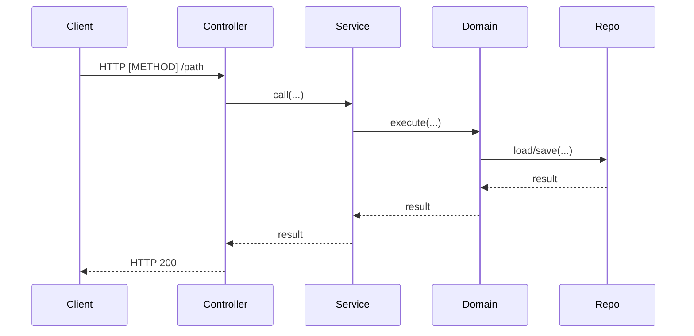

# Controller Sequence Mermaid

## Quick Start

When asked to document a controller flow, do the following:
1. Identify the target controller/endpoint (path, method, handler).
2. Trace the call chain from controller → business/service → domain → infra/repository.
3. Summarize the key actors and data exchanges.
4. Generate a Mermaid sequence diagram.
5. Create a markdown file containing the diagram and brief notes.

## Workflow

### 1) Locate the controller and endpoint
- Use `rg` or `SemanticSearch` to find the controller class and handler.
- Capture method name, route decorators, guards/interceptors that affect flow.

### 2) Trace downstream calls
- Follow injected services in the controller method.
- In the business layer, identify service methods called.
- In the domain layer, find domain services/entities invoked.
- In infra, capture repositories/storage calls when relevant.

### 3) Identify actors and payloads
- Actors usually include: Client, Controller, Business Service, Domain Service, Repository/Infra.
- Capture key DTOs, commands, or entities passed between layers.

### 4) Build the Mermaid sequence
- Use `sequenceDiagram`.
- Use short participant names with clear labels.
- Add notes for validation, auth, or error branches when obvious.

### 5) Write the markdown document
- Default location: `docs/scenarios/` unless the user specifies another.
- File naming: `controller-<feature>-sequence.md` (kebab-case).

## Markdown Template (Simple)

Use this structure unless the user specifies otherwise:

```markdown
# [Feature/Endpoint] Sequence

## Summary
- [1-2 bullet summary of the flow]

## Sequence Diagram


## Notes
- [Any validations, auth/guard checks, or error branches]
```

## Quality Checks
- Diagram reflects actual call order from code.
- Participants match real classes/services where possible.
- Markdown is concise; avoid speculative steps.

## When to Use
- The user asks to analyze controller flow/endpoints.
- The user asks for Mermaid sequence diagrams.
- The user wants a markdown document of request/response flow.
