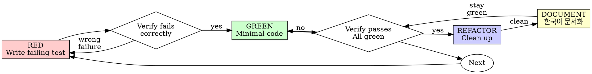

# Test-Driven Development (TDD)

## Overview

Write the test first. Watch it fail. Write minimal code to pass. **Document in Korean.**

**Core principle:** If you didn't watch the test fail, you don't know if it tests the right thing.

**Additional principle:** 테스트는 "무엇을 테스트하는지"가 아니라 "왜 이 테스트가 필요한지"까지 설명해야 한다.

**Violating the letter of the rules is violating the spirit of the rules.**

## When to Use

**Always:**
- New features
- Bug fixes
- Refactoring
- Behavior changes

**Exceptions (ask your human partner):**
- Throwaway prototypes
- Generated code
- Configuration files

Thinking "skip TDD just this once"? Stop. That's rationalization.

## The Iron Law

```
NO PRODUCTION CODE WITHOUT A FAILING TEST FIRST
```

Write code before the test? Delete it. Start over.

**No exceptions:**
- Don't keep it as "reference"
- Don't "adapt" it while writing tests
- Don't look at it
- Delete means delete

Implement fresh from tests. Period.

## Red-Green-Refactor-Document



### RED - Write Failing Test

Write one minimal test showing what should happen.

<Good>
```typescript
test('retries failed operations 3 times', async () => {
  let attempts = 0;
  const operation = () => {
    attempts++;
    if (attempts < 3) throw new Error('fail');
    return 'success';
  };

  const result = await retryOperation(operation);

  expect(result).toBe('success');
  expect(attempts).toBe(3);
});
```
Clear name, tests real behavior, one thing
</Good>

<Bad>
```typescript
test('retry works', async () => {
  const mock = jest.fn()
    .mockRejectedValueOnce(new Error())
    .mockRejectedValueOnce(new Error())
    .mockResolvedValueOnce('success');
  await retryOperation(mock);
  expect(mock).toHaveBeenCalledTimes(3);
});
```
Vague name, tests mock not code
</Bad>

**Requirements:**
- One behavior
- Clear name
- Real code (no mocks unless unavoidable)

### Verify RED - Watch It Fail

**MANDATORY. Never skip.**

```bash
npm test path/to/test.test.ts
```

Confirm:
- Test fails (not errors)
- Failure message is expected
- Fails because feature missing (not typos)

**Test passes?** You're testing existing behavior. Fix test.

**Test errors?** Fix error, re-run until it fails correctly.

### GREEN - Minimal Code

Write simplest code to pass the test.

<Good>
```typescript
async function retryOperation<T>(fn: () => Promise<T>): Promise<T> {
  for (let i = 0; i < 3; i++) {
    try {
      return await fn();
    } catch (e) {
      if (i === 2) throw e;
    }
  }
  throw new Error('unreachable');
}
```
Just enough to pass
</Good>

<Bad>
```typescript
async function retryOperation<T>(
  fn: () => Promise<T>,
  options?: {
    maxRetries?: number;
    backoff?: 'linear' | 'exponential';
    onRetry?: (attempt: number) => void;
  }
): Promise<T> {
  // YAGNI
}
```
Over-engineered
</Bad>

Don't add features, refactor other code, or "improve" beyond the test.

### Verify GREEN - Watch It Pass

**MANDATORY.**

```bash
npm test path/to/test.test.ts
```

Confirm:
- Test passes
- Other tests still pass
- Output pristine (no errors, warnings)

**Test fails?** Fix code, not test.

**Other tests fail?** Fix now.

### REFACTOR - Clean Up

After green only:
- Remove duplication
- Improve names
- Extract helpers

Keep tests green. Don't add behavior.

### DOCUMENT - 한국어 문서화 (신규)

**리팩토링 후 반드시 실행**

테스트가 GREEN 상태에서 한국어 문서화를 추가. 모든 테스트는 세 가지 질문에 답해야 한다:

1. **WHAT (무엇을):** 이 테스트가 검증하는 기능
2. **WHY (왜):** 이 테스트가 필요한 비즈니스/기술적 이유  
3. **HOW (어떻게):** 테스트가 검증을 수행하는 방식

#### describe 블록 문서화

```typescript
/**
 * ============================================================
 * 📦 [기능명] 테스트
 * ============================================================
 * 
 * 🎯 테스트 대상:
 *   - [테스트하는 클래스/함수명]
 *   
 * 📋 비즈니스 맥락:
 *   - [이 기능이 시스템에서 어떤 역할을 하는지]
 * 
 * ⚠️ 중요 고려사항:
 *   - [테스트 시 주의할 점]
 * ============================================================
 */
describe('FeatureName', () => {
  // ...
});
```

#### it 블록 문서화 (Given-When-Then)

```typescript
/**
 * 📌 테스트 시나리오: [시나리오 한글 설명]
 * 
 * 🎯 검증 목적:
 *   [왜 이 케이스를 테스트해야 하는지]
 * 
 * ✅ 기대 결과:
 *   [성공 시 어떤 결과가 나와야 하는지]
 */
it('should do something when condition', async () => {
  // ═══════════════════════════════════════════════════════
  // 📥 GIVEN (사전 조건 설정)
  // ═══════════════════════════════════════════════════════
  const request = { /* ... */ };
  
  // ═══════════════════════════════════════════════════════
  // 🎬 WHEN (테스트 실행)
  // ═══════════════════════════════════════════════════════
  const result = await service.someMethod(request);
  
  // ═══════════════════════════════════════════════════════
  // ✅ THEN (결과 검증)
  // ═══════════════════════════════════════════════════════
  expect(result).toEqual(expectedValue);
});
```

#### Mock 설명

```typescript
/**
 * 🎭 Mock 설정
 * 📍 mockRepository.findById:
 *   - 실제 동작: DB에서 ID로 엔티티 조회
 *   - Mock 이유: 실제 DB 연결 없이 테스트하기 위함
 */
```

#### 용어 일관성

| 영어 | 한국어 권장 |
|------|------------|
| Assert/Expect | 검증 |
| Mock | 목(Mock) |
| Given | 사전 조건 |
| When | 실행 / ~할 때 |
| Then | 결과 검증 |
| Should | ~해야 한다 |
| Edge case | 경계 케이스 |
| Happy path | 정상 흐름 |
| Error case | 에러 케이스 |

**피해야 할 패턴:**
- ❌ 영어 직역 ("그것은 ~해야 한다")
- ❌ 코드 내용 반복
- ❌ 비즈니스 맥락 없이 기술적 설명만
- ❌ 추상적인 설명 ("무언가를 테스트함")

**상세 문서화 가이드:** @test-code-korean-docs 스킬 참조

### Repeat

Next failing test for next feature.

## Good Tests

| Quality | Good | Bad |
|---------|------|-----|
| **Minimal** | One thing. "and" in name? Split it. | `test('validates email and domain and whitespace')` |
| **Clear** | Name describes behavior | `test('test1')` |
| **Shows intent** | Demonstrates desired API | Obscures what code should do |

## Why Order Matters

**"I'll write tests after to verify it works"**

Tests written after code pass immediately. Passing immediately proves nothing:
- Might test wrong thing
- Might test implementation, not behavior
- Might miss edge cases you forgot
- You never saw it catch the bug

Test-first forces you to see the test fail, proving it actually tests something.

**"I already manually tested all the edge cases"**

Manual testing is ad-hoc. You think you tested everything but:
- No record of what you tested
- Can't re-run when code changes
- Easy to forget cases under pressure
- "It worked when I tried it" ≠ comprehensive

Automated tests are systematic. They run the same way every time.

**"Deleting X hours of work is wasteful"**

Sunk cost fallacy. The time is already gone. Your choice now:
- Delete and rewrite with TDD (X more hours, high confidence)
- Keep it and add tests after (30 min, low confidence, likely bugs)

The "waste" is keeping code you can't trust. Working code without real tests is technical debt.

**"TDD is dogmatic, being pragmatic means adapting"**

TDD IS pragmatic:
- Finds bugs before commit (faster than debugging after)
- Prevents regressions (tests catch breaks immediately)
- Documents behavior (tests show how to use code)
- Enables refactoring (change freely, tests catch breaks)

"Pragmatic" shortcuts = debugging in production = slower.

**"Tests after achieve the same goals - it's spirit not ritual"**

No. Tests-after answer "What does this do?" Tests-first answer "What should this do?"

Tests-after are biased by your implementation. You test what you built, not what's required. You verify remembered edge cases, not discovered ones.

Tests-first force edge case discovery before implementing. Tests-after verify you remembered everything (you didn't).

30 minutes of tests after ≠ TDD. You get coverage, lose proof tests work.

## Common Rationalizations

| Excuse | Reality |
|--------|---------|
| "Too simple to test" | Simple code breaks. Test takes 30 seconds. |
| "I'll test after" | Tests passing immediately prove nothing. |
| "Tests after achieve same goals" | Tests-after = "what does this do?" Tests-first = "what should this do?" |
| "Already manually tested" | Ad-hoc ≠ systematic. No record, can't re-run. |
| "Deleting X hours is wasteful" | Sunk cost fallacy. Keeping unverified code is technical debt. |
| "Keep as reference, write tests first" | You'll adapt it. That's testing after. Delete means delete. |
| "Need to explore first" | Fine. Throw away exploration, start with TDD. |
| "Test hard = design unclear" | Listen to test. Hard to test = hard to use. |
| "TDD will slow me down" | TDD faster than debugging. Pragmatic = test-first. |
| "Manual test faster" | Manual doesn't prove edge cases. You'll re-test every change. |
| "Existing code has no tests" | You're improving it. Add tests for existing code. |

## Red Flags - STOP and Start Over

### TDD Red Flags
- Code before test
- Test after implementation
- Test passes immediately
- Can't explain why test failed
- Tests added "later"
- Rationalizing "just this once"
- "I already manually tested it"
- "Tests after achieve the same purpose"
- "It's about spirit not ritual"
- "Keep as reference" or "adapt existing code"
- "Already spent X hours, deleting is wasteful"
- "TDD is dogmatic, I'm being pragmatic"
- "This is different because..."

### 문서화 Red Flags
- 테스트에 한국어 주석이 없음
- 영어 직역 주석 ("그것은 ~해야 한다")
- 코드 내용 단순 반복 (`// id를 'test-id'로 설정`)
- 비즈니스 맥락 없이 기술적 설명만
- Given/When/Then 구분 없음
- Mock 사용 이유 설명 없음

**All of these mean: Delete code. Start over with TDD + 문서화.**

## Example: Bug Fix

**Bug:** Empty email accepted

**RED**
```typescript
test('rejects empty email', async () => {
  const result = await submitForm({ email: '' });
  expect(result.error).toBe('Email required');
});
```

**Verify RED**
```bash
$ npm test
FAIL: expected 'Email required', got undefined
```

**GREEN**
```typescript
function submitForm(data: FormData) {
  if (!data.email?.trim()) {
    return { error: 'Email required' };
  }
  // ...
}
```

**Verify GREEN**
```bash
$ npm test
PASS
```

**REFACTOR**
Extract validation for multiple fields if needed.

## Verification Checklist

Before marking work complete:

### TDD 체크리스트
- [ ] Every new function/method has a test
- [ ] Watched each test fail before implementing
- [ ] Each test failed for expected reason (feature missing, not typo)
- [ ] Wrote minimal code to pass each test
- [ ] All tests pass
- [ ] Output pristine (no errors, warnings)
- [ ] Tests use real code (mocks only if unavoidable)
- [ ] Edge cases and errors covered

### 한국어 문서화 체크리스트
- [ ] 모든 describe 블록에 기능 개요가 있는가?
- [ ] 모든 it 블록에 테스트 목적이 설명되어 있는가?
- [ ] Given/When/Then이 명확히 구분되어 있는가?
- [ ] Mock 설정의 이유가 설명되어 있는가?
- [ ] 비즈니스 맥락이 포함되어 있는가?
- [ ] 용어가 일관되게 사용되었는가?

Can't check all boxes? You skipped TDD or documentation. Start over.

## When Stuck

| Problem | Solution |
|---------|----------|
| Don't know how to test | Write wished-for API. Write assertion first. Ask your human partner. |
| Test too complicated | Design too complicated. Simplify interface. |
| Must mock everything | Code too coupled. Use dependency injection. |
| Test setup huge | Extract helpers. Still complex? Simplify design. |

## Debugging Integration

Bug found? Write failing test reproducing it. Follow TDD cycle. Test proves fix and prevents regression.

Never fix bugs without a test.

## Testing Anti-Patterns

When adding mocks or test utilities, read @testing-anti-patterns.md to avoid common pitfalls:
- Testing mock behavior instead of real behavior
- Adding test-only methods to production classes
- Mocking without understanding dependencies

## Related Skills

- **@test-code-korean-docs**: 상세한 한국어 문서화 가이드 및 예시
- **@testing-anti-patterns.md**: Mock 사용 시 피해야 할 패턴

## Final Rule

```
Production code → test exists and failed first → 한국어 문서화 완료
Otherwise → not TDD
```

모든 테스트 주석은 다음 질문에 답해야 한다:
1. 이 테스트는 무엇을 검증하는가?
2. 왜 이 검증이 필요한가?
3. 이 시나리오는 어떤 상황을 나타내는가?

No exceptions without your human partner's permission.
