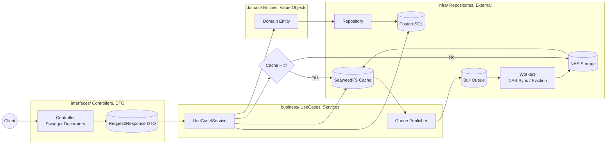

# 0000. 아키텍쳐

현재 파일 서버의 레이어 구조와 데이터 흐름을 Mermaid로 정리한 문서입니다.

```mermaid
flowchart LR
    Client((Client))

    subgraph Interfaces[interfaces/ Controllers, DTO]
        API[Controller\nSwagger Decorators]
        DTO[(Request/Response DTO)]
    end

    subgraph Business[business/ UseCases, Services]
        UseCase[UseCase/Service]
        QueuePub[Queue Publisher]
    end

    subgraph Domain[domain/ Entities, Value Objects]
        Entity[Domain Entity]
    end

    subgraph Infra[infra/ Repositories, External]
        Repo[Repository]
        DB[(PostgreSQL)]
        Cache[(SeaweedFS Cache)]
        NAS[(NAS Storage)]
        Bull[(Bull Queue)]
        Worker[Workers\nNAS Sync / Eviction]
    end

    Client --> API --> DTO --> UseCase --> Entity --> Repo --> DB

    %% 업로드/저장 경로
    UseCase --> Cache
    Cache --> QueuePub --> Bull --> Worker --> NAS

    %% 조회 경로
    UseCase --> Hit{Cache Hit?}
    Hit -- "Yes" --> Cache
    Hit -- "No" --> NAS --> Cache

    %% 상태/이력 기록
    UseCase --> DB
```

