# 005-1. 파일 처리 FLOW

파일 관련 API의 시퀀스 다이어그램

---

## 1. 파일 업로드

### 1-1. POST /files/upload - 일반 업로드 (100MB 미만)

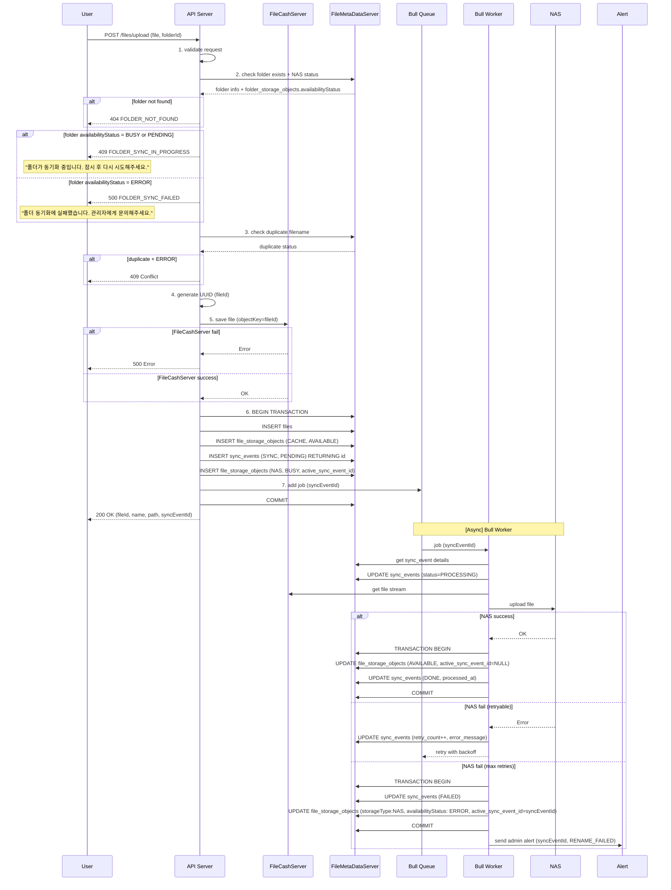
```mermaid
sequenceDiagram
    participant User as User
    participant API as API Server
    participant Cache as FileCashServer 
    participant DB as FileMetaDataServer
    participant Bull as Bull Queue
    participant Worker as Bull Worker
    participant NAS as NAS

    User->>API: POST /files/upload (file, folderId)
    
    API->>API: 1. validate request
    
    API->>DB: 2. check folder exists + NAS status
    DB-->>API: folder info + folder_storage_objects.availabilityStatus
    
    alt folder not found
        API-->>User: 404 FOLDER_NOT_FOUND
    end
    
    alt folder availabilityStatus = BUSY or PENDING
        API-->>User: 409 FOLDER_SYNC_IN_PROGRESS
        Note over User: "폴더가 동기화 중입니다. 잠시 후 다시 시도해주세요."
    else folder availabilityStatus = ERROR
        API-->>User: 500 FOLDER_SYNC_FAILED
        Note over User: "폴더 동기화에 실패했습니다. 관리자에게 문의해주세요."
    end
    
    API->>DB: 3. check duplicate filename
    DB-->>API: duplicate status
    
    alt duplicate + ERROR
        API-->>User: 409 Conflict
    end
    
    API->>API: 4. generate UUID (fileId)
    
    API->>Cache: 5. save file (objectKey=fileId)
    
    alt FileCashServer fail
        Cache-->>API: Error
        API-->>User: 500 Error
    else FileCashServer success
        Cache-->>API: OK
    end
    
    API->>DB: 6. BEGIN TRANSACTION
    API->>DB: INSERT files
    API->>DB: INSERT file_storage_objects (CACHE, AVAILABLE)
    API->>DB: INSERT sync_events (SYNC, PENDING) RETURNING id
    API->>DB: INSERT file_storage_objects (NAS, BUSY, active_sync_event_id)
    API->>Bull: 7. add job (syncEventId)
    API->>DB: COMMIT
    
    
    
    API-->>User: 200 OK (fileId, name, path, syncEventId)
    
    Note over Bull,NAS: [Async] Bull Worker
    Bull->>Worker: job (syncEventId)
    Worker->>DB: get sync_event details
    Worker->>DB: UPDATE sync_events (status=PROCESSING)
    Worker->>Cache: get file stream
    Worker->>NAS: upload file
    
    alt NAS success
        NAS-->>Worker: OK
        Worker->>DB: TRANSACTION BEGIN
        Worker->>DB: UPDATE file_storage_objects (AVAILABLE, active_sync_event_id=NULL)
        Worker->>DB: UPDATE sync_events (DONE, processed_at)
        Worker->>DB: COMMIT
    else NAS fail (retryable)
        NAS-->>Worker: Error
        Worker->>DB: UPDATE sync_events (retry_count++, error_message)
        Worker-->>Bull: retry with backoff
    else NAS fail (max retries)
        Worker->>DB: TRANSACTION BEGIN
        Worker->>DB: UPDATE sync_events (FAILED)
        Worker->>DB: UPDATE file_storage_objects (storageType:NAS, availabilityStatus: ERROR, active_sync_event_id=syncEventId)
        Worker->>DB: COMMIT
        Worker->>Alert: send admin alert (syncEventId, RENAME_FAILED)
    end
```

---

### 1-2. POST /files/multipart/initiate - 멀티파트 업로드 초기화

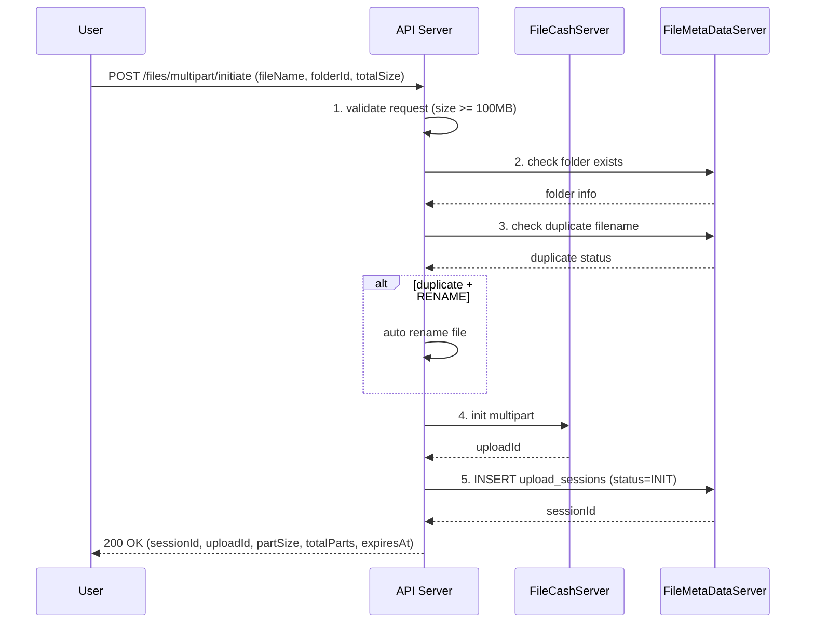
```mermaid
sequenceDiagram
    participant User as User
    participant API as API Server
    participant Cache as FileCashServer 
    participant DB as FileMetaDataServer

    User->>API: POST /files/multipart/initiate (fileName, folderId, totalSize)
    
    API->>API: 1. validate request (size >= 100MB)
    
    API->>DB: 2. check folder exists
    DB-->>API: folder info
    
    API->>DB: 3. check duplicate filename
    DB-->>API: duplicate status
    
    alt duplicate + RENAME
        API->>API: auto rename file
    end
    
    API->>Cache: 4. init multipart
    Cache-->>API: uploadId
    
    API->>DB: 5. INSERT upload_sessions (status=INIT)
    DB-->>API: sessionId
    
    API-->>User: 200 OK (sessionId, uploadId, partSize, totalParts, expiresAt)
```

---

### 1-3. PUT /files/multipart/{sessionId}/parts/{partNumber} - 파트 업로드

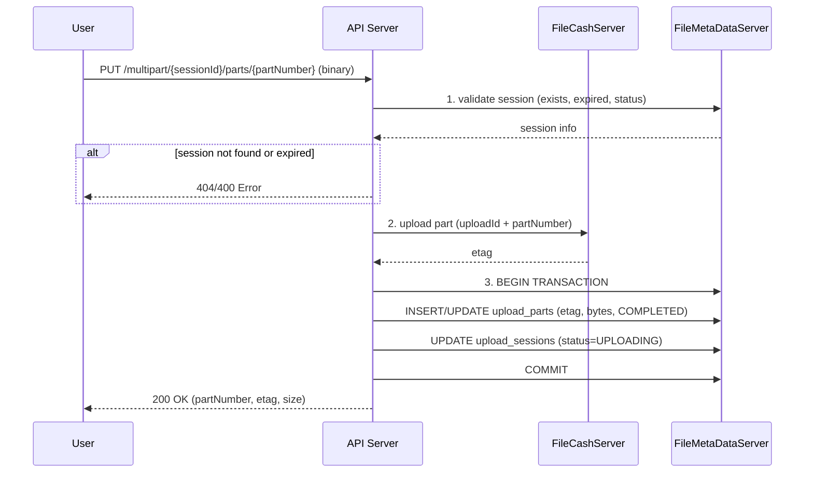
```mermaid
sequenceDiagram
    participant User as User
    participant API as API Server
    participant Cache as FileCashServer 
    participant DB as FileMetaDataServer

    User->>API: PUT /multipart/{sessionId}/parts/{partNumber} (binary)
    
    API->>DB: 1. validate session (exists, expired, status)
    DB-->>API: session info
    
    alt session not found or expired
        API-->>User: 404/400 Error
    end
    
    API->>Cache: 2. upload part (uploadId + partNumber)
    Cache-->>API: etag
    
    API->>DB: 3. BEGIN TRANSACTION
    API->>DB: INSERT/UPDATE upload_parts (etag, bytes, COMPLETED)
    API->>DB: UPDATE upload_sessions (status=UPLOADING)
    API->>DB: COMMIT
    
    API-->>User: 200 OK (partNumber, etag, size)
```

---

### 1-4. POST /files/multipart/{sessionId}/complete - 멀티파트 완료

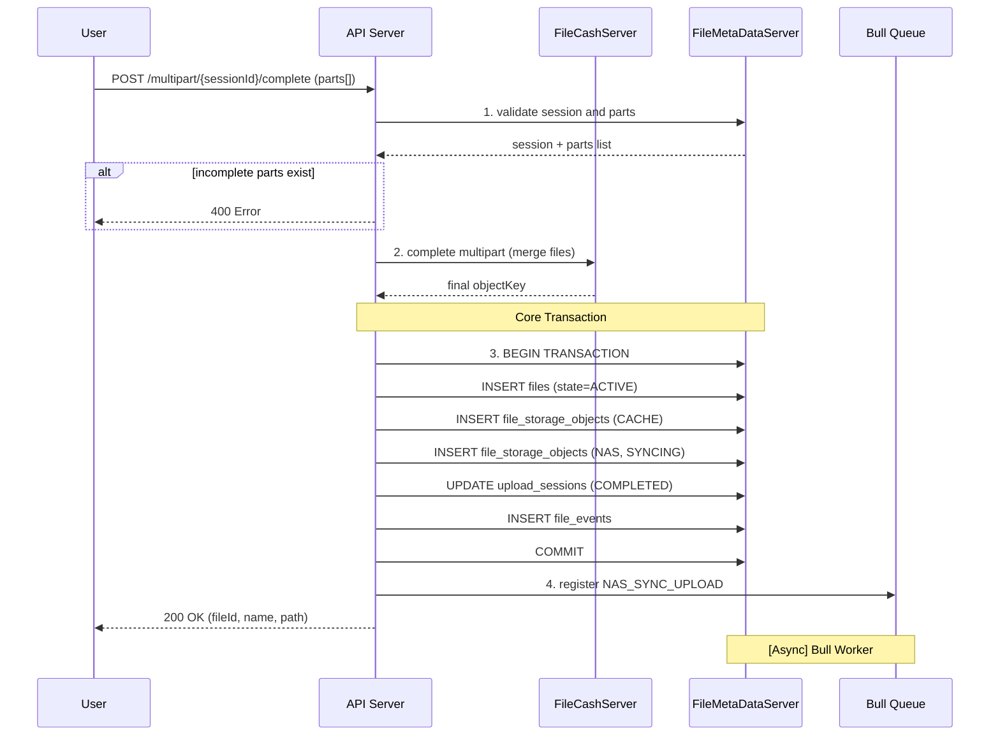
```mermaid
sequenceDiagram
    participant User as User
    participant API as API Server
    participant Cache as FileCashServer 
    participant DB as FileMetaDataServer
    participant Bull as Bull Queue

    User->>API: POST /multipart/{sessionId}/complete (parts[])
    
    API->>DB: 1. validate session and parts
    DB-->>API: session + parts list
    
    alt incomplete parts exist
        API-->>User: 400 Error
    end
    
    API->>Cache: 2. complete multipart (merge files)
    Cache-->>API: final objectKey
    
    Note over API,DB: Core Transaction
    API->>DB: 3. BEGIN TRANSACTION
    API->>DB: INSERT files (state=ACTIVE)
    API->>DB: INSERT file_storage_objects (CACHE)
    API->>DB: INSERT file_storage_objects (NAS, SYNCING)
    API->>DB: UPDATE upload_sessions (COMPLETED)
    API->>DB: INSERT file_events
    API->>DB: COMMIT
    
    API->>Bull: 4. register NAS_SYNC_UPLOAD
    
    API-->>User: 200 OK (fileId, name, path)
    
    Note over Bull,DB: [Async] Bull Worker
```

---

### 1-5. GET /files/multipart/{sessionId}/status - 세션 상태 조회 (Resume)

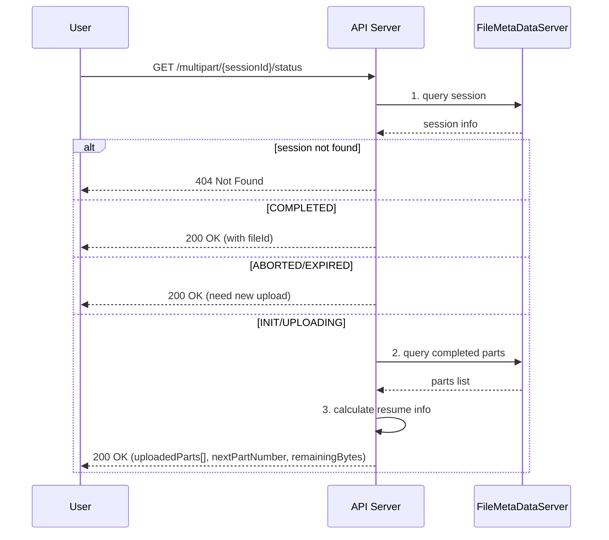
```mermaid
sequenceDiagram
    participant User as User
    participant API as API Server
    participant DB as FileMetaDataServer

    User->>API: GET /multipart/{sessionId}/status
    
    API->>DB: 1. query session
    DB-->>API: session info
    
    alt session not found
        API-->>User: 404 Not Found
    else COMPLETED
        API-->>User: 200 OK (with fileId)
    else ABORTED/EXPIRED
        API-->>User: 200 OK (need new upload)
    else INIT/UPLOADING
        API->>DB: 2. query completed parts
        DB-->>API: parts list
        
        API->>API: 3. calculate resume info
        
        API-->>User: 200 OK (uploadedParts[], nextPartNumber, remainingBytes)
    end
```

---

### 1-6. DELETE /files/multipart/{sessionId} - 업로드 취소

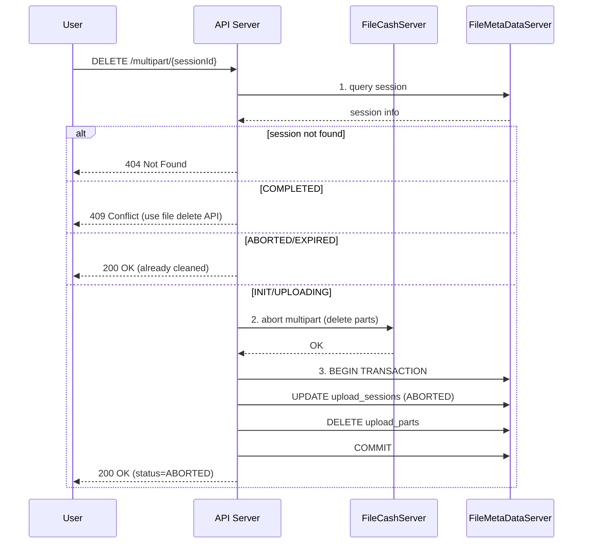
```mermaid
sequenceDiagram
    participant User as User
    participant API as API Server
    participant Cache as FileCashServer 
    participant DB as FileMetaDataServer

    User->>API: DELETE /multipart/{sessionId}
    
    API->>DB: 1. query session
    DB-->>API: session info
    
    alt session not found
        API-->>User: 404 Not Found
    else COMPLETED
        API-->>User: 409 Conflict (use file delete API)
    else ABORTED/EXPIRED
        API-->>User: 200 OK (already cleaned)
    else INIT/UPLOADING
        API->>Cache: 2. abort multipart (delete parts)
        Cache-->>API: OK
        
        API->>DB: 3. BEGIN TRANSACTION
        API->>DB: UPDATE upload_sessions (ABORTED)
        API->>DB: DELETE upload_parts
        API->>DB: COMMIT
        
        API-->>User: 200 OK (status=ABORTED)
    end
```

---

## 2. 파일 조회/다운로드

### 2-1. GET /files/{fileId} - 파일 정보 조회

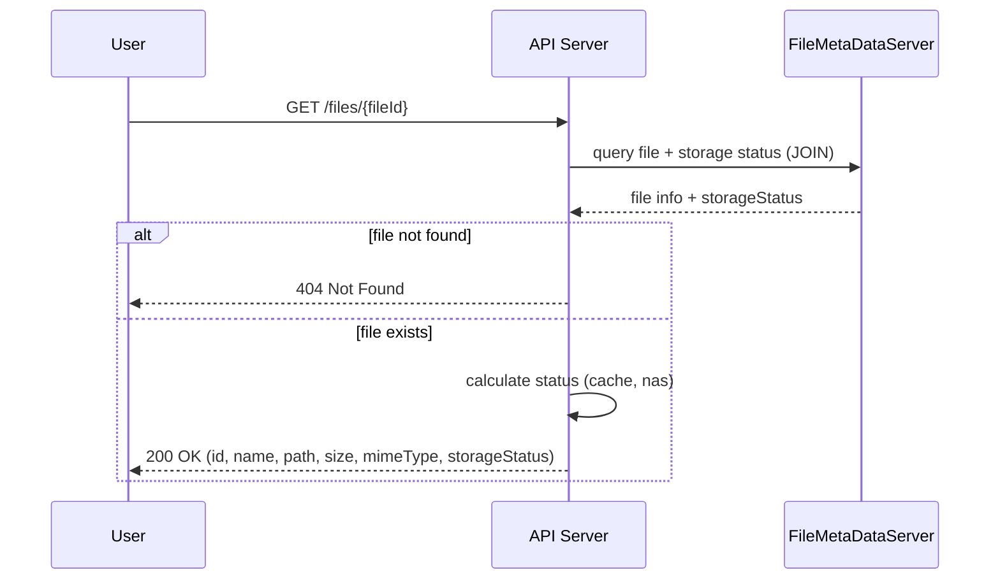
```mermaid
sequenceDiagram
    participant User as User
    participant API as API Server
    participant DB as FileMetaDataServer

    User->>API: GET /files/{fileId}
    
    API->>DB: query file + storage status (JOIN)
    DB-->>API: file info + storageStatus
    
    alt file not found
        API-->>User: 404 Not Found
    else file exists
        API->>API: calculate status (cache, nas)
        API-->>User: 200 OK (id, name, path, size, mimeType, storageStatus)
    end
```

---

### 2-2. GET /files/{fileId}/download - 파일 다운로드

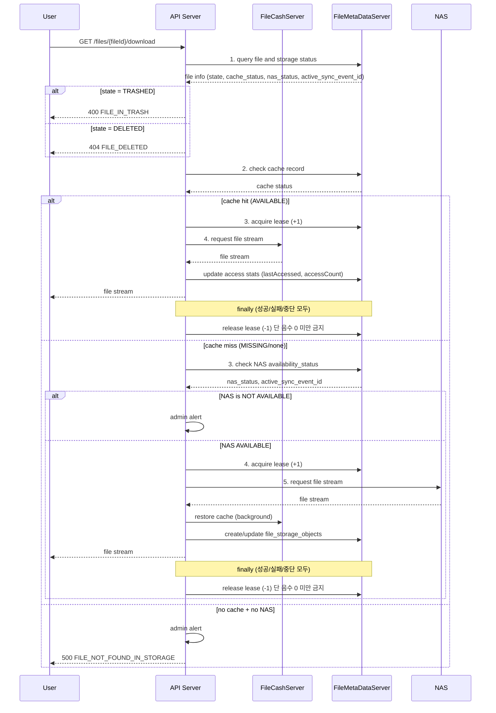
```mermaid
sequenceDiagram
    participant User as User
    participant API as API Server
    participant Cache as FileCashServer 
    participant DB as FileMetaDataServer
    participant NAS as NAS

    User->>API: GET /files/{fileId}/download
    
    API->>DB: 1. query file and storage status
    DB-->>API: file info (state, cache_status, nas_status, active_sync_event_id)
    
    alt state = TRASHED
        API-->>User: 400 FILE_IN_TRASH
    else state = DELETED
        API-->>User: 404 FILE_DELETED
    end
    
    API->>DB: 2. check cache record
    DB-->>API: cache status
    
    alt cache hit (AVAILABLE)
        API->>DB: 3. acquire lease (+1)
        API->>Cache: 4. request file stream
        Cache-->>API: file stream
        API->>DB: update access stats (lastAccessed, accessCount)
        API-->>User: file stream
        Note over API,DB: finally (성공/실패/중단 모두)
        API->>DB: release lease (-1) 단 음수 0 미만 금지
        
    else cache miss (MISSING/none)
        API->>DB: 3. check NAS availability_status
        DB-->>API: nas_status, active_sync_event_id
        
        alt NAS is NOT  AVAILABLE
           API->>API: admin alert 
        else NAS AVAILABLE
            API->>DB: 4. acquire lease (+1)
            API->>NAS: 5. request file stream
            NAS-->>API: file stream
            API->>Cache: restore cache (background)
            API->>DB: create/update file_storage_objects
            API-->>User: file stream
            Note over API,DB: finally (성공/실패/중단 모두)
            API->>DB: release lease (-1) 단 음수 0 미만 금지
        end
        
    else no cache + no NAS
        API->>API: admin alert
        API-->>User: 500 FILE_NOT_FOUND_IN_STORAGE
    end
```

**스트림 종료/오류 처리:**
- `stream.on('close')` / `stream.on('error')` / `stream.on('end')` 이벤트에서 **반드시** `release lease (-1)` 수행
- **finally 패턴**으로 모든 경로에서 lease 해제 보장

---

## 3. 파일 수정

### 3-1. PUT /files/{fileId}/rename - 파일명 변경

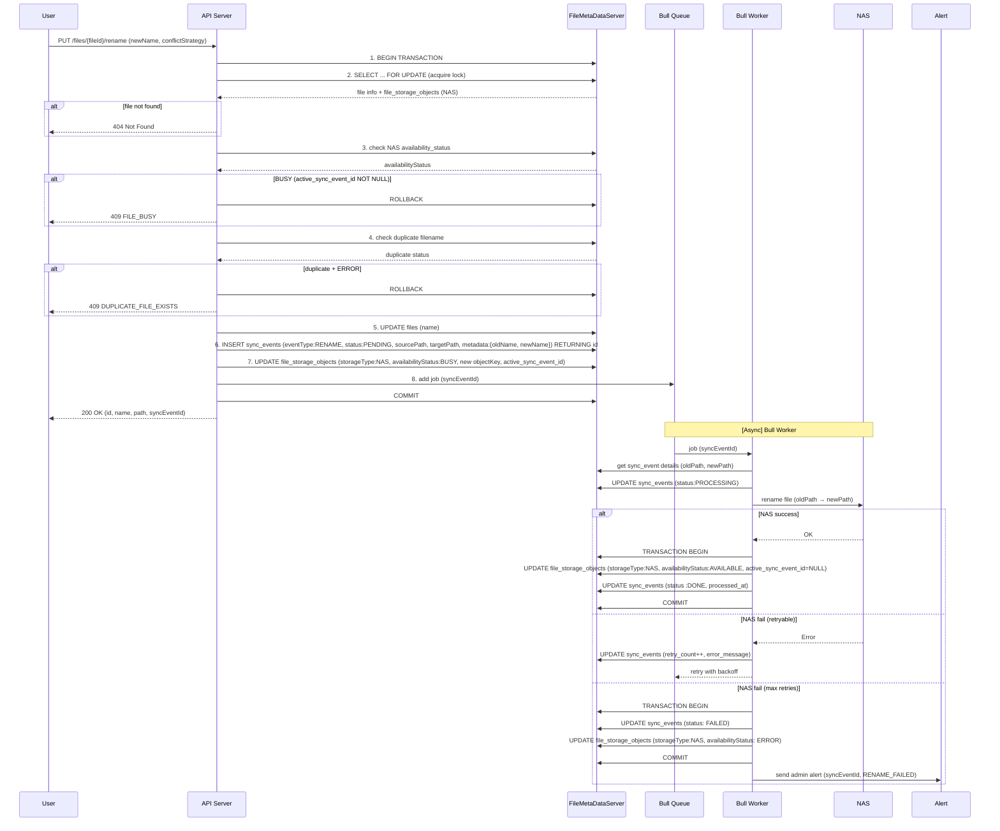
```mermaid
sequenceDiagram
    participant User as User
    participant API as API Server
    participant DB as FileMetaDataServer
    participant Bull as Bull Queue
    participant Worker as Bull Worker
    participant NAS as NAS

    User->>API: PUT /files/{fileId}/rename (newName, conflictStrategy)
    
    API->>DB: 1. BEGIN TRANSACTION
    
    API->>DB: 2. SELECT ... FOR UPDATE (acquire lock)
    DB-->>API: file info + file_storage_objects (NAS)
    
    alt file not found
        API-->>User: 404 Not Found
    end
    
    API->>DB: 3. check NAS availability_status
    DB-->>API: availabilityStatus
    
    alt BUSY (active_sync_event_id NOT NULL)
        API->>DB: ROLLBACK
        API-->>User: 409 FILE_BUSY
    end
    
    API->>DB: 4. check duplicate filename
    DB-->>API: duplicate status
    
    alt duplicate + ERROR
        API->>DB: ROLLBACK
        API-->>User: 409 DUPLICATE_FILE_EXISTS
    end
    
    API->>DB: 5. UPDATE files (name)
    API->>DB: 6. INSERT sync_events (eventType:RENAME, status:PENDING, sourcePath, targetPath, metadata:{oldName, newName}) RETURNING id
    API->>DB: 7. UPDATE file_storage_objects (storageType:NAS, availabilityStatus:BUSY, new objectKey, active_sync_event_id)
    API->>Bull: 8. add job (syncEventId)
    API->>DB: COMMIT
    
    
    API-->>User: 200 OK (id, name, path, syncEventId)
    
    Note over Bull,NAS: [Async] Bull Worker
    Bull->>Worker: job (syncEventId)
    Worker->>DB: get sync_event details (oldPath, newPath)
    Worker->>DB: UPDATE sync_events (status:PROCESSING)
    Worker->>NAS: rename file (oldPath → newPath)
    
    alt NAS success
        NAS-->>Worker: OK
        Worker->>DB: TRANSACTION BEGIN
        Worker->>DB: UPDATE file_storage_objects (storageType:NAS, availabilityStatus:AVAILABLE, active_sync_event_id=NULL)
        Worker->>DB: UPDATE sync_events (status :DONE, processed_at)
        Worker->>DB: COMMIT
    else NAS fail (retryable)
        NAS-->>Worker: Error
        Worker->>DB: UPDATE sync_events (retry_count++, error_message)
        Worker-->>Bull: retry with backoff
    else NAS fail (max retries)
        Worker->>DB: TRANSACTION BEGIN
        Worker->>DB: UPDATE sync_events (status: FAILED)
        Worker->>DB: UPDATE file_storage_objects (storageType:NAS,  availabilityStatus: ERROR)
        Worker->>DB: COMMIT
        Worker->>Alert: send admin alert (syncEventId, RENAME_FAILED)
    end
```

---

### 3-2. POST /files/{fileId}/move - 파일 이동

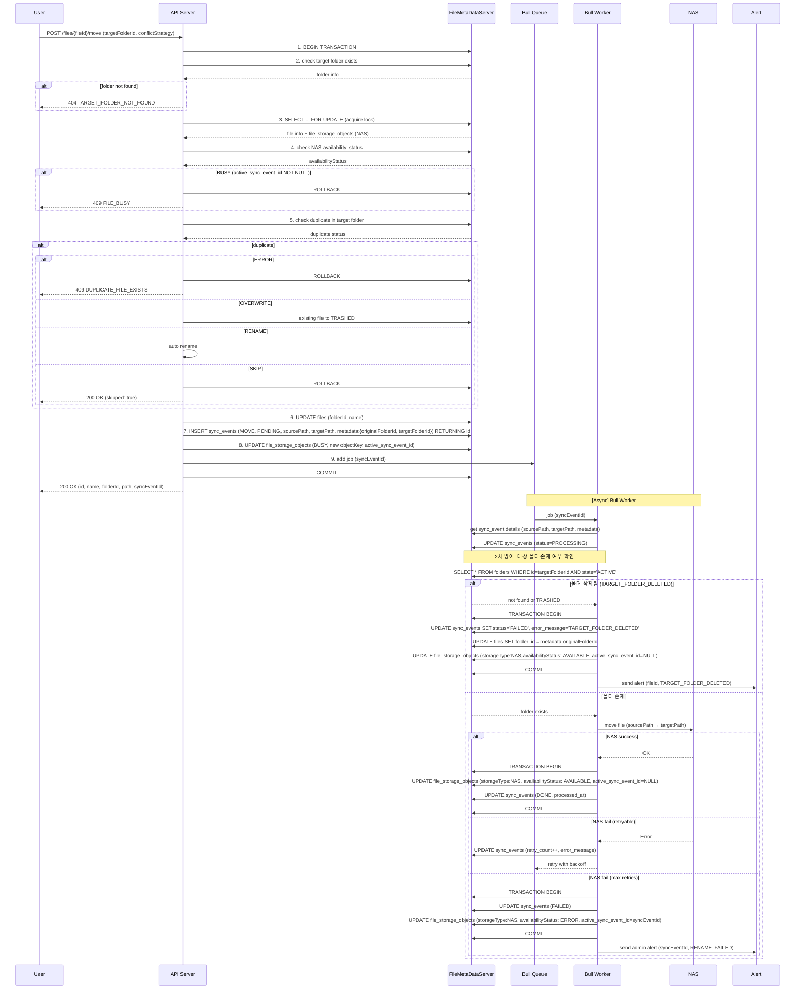
```mermaid
sequenceDiagram
    participant User as User
    participant API as API Server
    participant DB as FileMetaDataServer
    participant Bull as Bull Queue
    participant Worker as Bull Worker
    participant NAS as NAS

    User->>API: POST /files/{fileId}/move (targetFolderId, conflictStrategy)
    
    API->>DB: 1. BEGIN TRANSACTION
    
    API->>DB: 2. check target folder exists
    DB-->>API: folder info
    
    alt folder not found
        API-->>User: 404 TARGET_FOLDER_NOT_FOUND
    end
    
    API->>DB: 3. SELECT ... FOR UPDATE (acquire lock)
    DB-->>API: file info + file_storage_objects (NAS)
    
    API->>DB: 4. check NAS availability_status
    DB-->>API: availabilityStatus
    
    alt BUSY (active_sync_event_id NOT NULL)
        API->>DB: ROLLBACK
        API-->>User: 409 FILE_BUSY
    end
    
    API->>DB: 5. check duplicate in target folder
    DB-->>API: duplicate status
    
    alt duplicate
        alt ERROR
            API->>DB: ROLLBACK
            API-->>User: 409 DUPLICATE_FILE_EXISTS
        else OVERWRITE
            API->>DB: existing file to TRASHED
        else RENAME
            API->>API: auto rename
        else SKIP
            API->>DB: ROLLBACK
            API-->>User: 200 OK (skipped: true)
        end
    end
    
    API->>DB: 6. UPDATE files (folderId, name)
    API->>DB: 7. INSERT sync_events (MOVE, PENDING, sourcePath, targetPath, metadata:{originalFolderId, targetFolderId}) RETURNING id
    API->>DB: 8. UPDATE file_storage_objects (BUSY, new objectKey, active_sync_event_id)
    API->>Bull: 9. add job (syncEventId)
    API->>DB: COMMIT
    
    
    API-->>User: 200 OK (id, name, folderId, path, syncEventId)
    
    Note over Bull,NAS: [Async] Bull Worker
    Bull->>Worker: job (syncEventId)
    Worker->>DB: get sync_event details (sourcePath, targetPath, metadata)
    Worker->>DB: UPDATE sync_events (status=PROCESSING)
    
    Note over Worker,DB: 2차 방어: 대상 폴더 존재 여부 확인
    Worker->>DB: SELECT * FROM folders WHERE id=targetFolderId AND state='ACTIVE'
    
    alt 폴더 삭제됨 (TARGET_FOLDER_DELETED)
        DB-->>Worker: not found or TRASHED
        Worker->>DB: TRANSACTION BEGIN
        Worker->>DB: UPDATE sync_events SET status='FAILED', error_message='TARGET_FOLDER_DELETED'
        Worker->>DB: UPDATE files SET folder_id = metadata.originalFolderId
        Worker->>DB: UPDATE file_storage_objects (storageType:NAS,availabilityStatus:  AVAILABLE, active_sync_event_id=NULL)
        Worker->>DB: COMMIT
        Worker->>Alert: send alert (fileId, TARGET_FOLDER_DELETED)
    else 폴더 존재
        DB-->>Worker: folder exists
        Worker->>NAS: move file (sourcePath → targetPath)
        
        alt NAS success
            NAS-->>Worker: OK
            Worker->>DB: TRANSACTION BEGIN
            Worker->>DB: UPDATE file_storage_objects (storageType:NAS, availabilityStatus: AVAILABLE, active_sync_event_id=NULL)
            Worker->>DB: UPDATE sync_events (DONE, processed_at)
            Worker->>DB: COMMIT
        else NAS fail (retryable)
            NAS-->>Worker: Error
            Worker->>DB: UPDATE sync_events (retry_count++, error_message)
            Worker-->>Bull: retry with backoff
        else NAS fail (max retries)
            Worker->>DB: TRANSACTION BEGIN
            Worker->>DB: UPDATE sync_events (FAILED)
            Worker->>DB: UPDATE file_storage_objects (storageType:NAS, availabilityStatus: ERROR, active_sync_event_id=syncEventId)
            Worker->>DB: COMMIT
            Worker->>Alert: send admin alert (syncEventId, RENAME_FAILED)


        end
    end
```

---

## 4. 파일 삭제

### 4-1. DELETE /files/{fileId} - 파일 삭제 (휴지통)

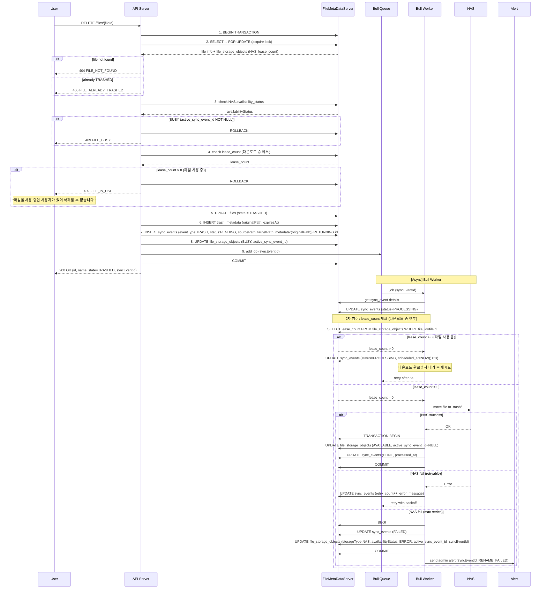
```mermaid
sequenceDiagram
    participant User as User
    participant API as API Server
    participant DB as FileMetaDataServer
    participant Bull as Bull Queue
    participant Worker as Bull Worker
    participant NAS as NAS

    User->>API: DELETE /files/{fileId}
    
    API->>DB: 1. BEGIN TRANSACTION
    
    API->>DB: 2. SELECT ... FOR UPDATE (acquire lock)
    DB-->>API: file info + file_storage_objects (NAS, lease_count)
    
    alt file not found
        API-->>User: 404 FILE_NOT_FOUND
    else already TRASHED
        API-->>User: 400 FILE_ALREADY_TRASHED
    end
    
    API->>DB: 3. check NAS availability_status
    DB-->>API: availabilityStatus
    
    alt BUSY (active_sync_event_id NOT NULL)
        API->>DB: ROLLBACK
        API-->>User: 409 FILE_BUSY
    end
    
    API->>DB: 4. check lease_count (다운로드 중 여부)
    DB-->>API: lease_count
    
    alt lease_count > 0 (파일 사용 중)
        API->>DB: ROLLBACK
        API-->>User: 409 FILE_IN_USE
        Note over User: "파일을 사용 중인 사용자가 있어 삭제할 수 없습니다."
    end
    
    API->>DB: 5. UPDATE files (state = TRASHED)
    API->>DB: 6. INSERT trash_metadata (originalPath, expiresAt)
    API->>DB: 7. INSERT sync_events (eventType:TRASH, status:PENDING, sourcePath, targetPath, metadata:{originalPath}) RETURNING id
    API->>DB: 8. UPDATE file_storage_objects (BUSY, active_sync_event_id)
    API->>Bull: 9. add job (syncEventId)
    API->>DB: COMMIT
    
    
    API-->>User: 200 OK (id, name, state=TRASHED, syncEventId)
    
    Note over Bull,NAS: [Async] Bull Worker
    Bull->>Worker: job (syncEventId)
    Worker->>DB: get sync_event details
    Worker->>DB: UPDATE sync_events (status=PROCESSING)
    
    Note over Worker,DB: 2차 방어: lease_count 체크 (다운로드 중 여부)
    Worker->>DB: SELECT lease_count FROM file_storage_objects WHERE file_id=fileId
    
    alt lease_count > 0 (파일 사용 중)
        DB-->>Worker: lease_count > 0
        Worker->>DB: UPDATE sync_events (status=PROCESSING, scheduled_at=NOW()+5s)
        Note over Worker: 다운로드 완료까지 대기 후 재시도
        Worker-->>Bull: retry after 5s
    else lease_count = 0
        DB-->>Worker: lease_count = 0
        Worker->>NAS: move file to .trash/
        
        alt NAS success
            NAS-->>Worker: OK
            Worker->>DB: TRANSACTION BEGIN
            Worker->>DB: UPDATE file_storage_objects (AVAILABLE, active_sync_event_id=NULL)
            Worker->>DB: UPDATE sync_events (DONE, processed_at)
            Worker->>DB: COMMIT
        else NAS fail (retryable)
            NAS-->>Worker: Error
            Worker->>DB: UPDATE sync_events (retry_count++, error_message)
            Worker-->>Bull: retry with backoff
        else NAS fail (max retries)
            Worker->>DB: BEGI
            Worker->>DB: UPDATE sync_events (FAILED)
            Worker->>DB: UPDATE file_storage_objects (storageType:NAS, availabilityStatus: ERROR, active_sync_event_id=syncEventId)
            Worker->>DB: COMMIT
            Worker->>Alert: send admin alert (syncEventId, RENAME_FAILED)
        end
    end
```

---

## 5. Bull Worker 공통 처리

### 5-1. NAS 동기화 Worker

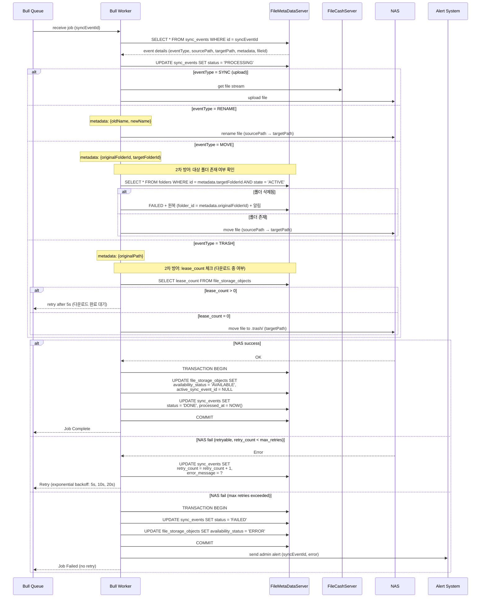
```mermaid
sequenceDiagram
    participant Bull as Bull Queue
    participant Worker as Bull Worker
    participant DB as FileMetaDataServer
    participant Cache as FileCashServer
    participant NAS as NAS
    participant Alert as Alert System

    Bull->>Worker: receive job (syncEventId)
    
    Worker->>DB: SELECT * FROM sync_events WHERE id = syncEventId
    DB-->>Worker: event details (eventType, sourcePath, targetPath, metadata, fileId)
    
    Worker->>DB: UPDATE sync_events SET status = 'PROCESSING'
    
    alt eventType = SYNC (upload)
        Worker->>Cache: get file stream
        Worker->>NAS: upload file
    else eventType = RENAME
        Note over Worker: metadata: {oldName, newName}
        Worker->>NAS: rename file (sourcePath → targetPath)
    else eventType = MOVE
        Note over Worker: metadata: {originalFolderId, targetFolderId}
        Note over Worker,DB: 2차 방어: 대상 폴더 존재 여부 확인
        Worker->>DB: SELECT * FROM folders WHERE id = metadata.targetFolderId AND state = 'ACTIVE'
        alt 폴더 삭제됨
            Worker->>DB: FAILED + 원복 (folder_id = metadata.originalFolderId) + 알림
        else 폴더 존재
            Worker->>NAS: move file (sourcePath → targetPath)
        end
    else eventType = TRASH
        Note over Worker: metadata: {originalPath}
        Note over Worker,DB: 2차 방어: lease_count 체크 (다운로드 중 여부)
        Worker->>DB: SELECT lease_count FROM file_storage_objects
        alt lease_count > 0
            Worker-->>Bull: retry after 5s (다운로드 완료 대기)
        else lease_count = 0
            Worker->>NAS: move file to .trash/ (targetPath)
        end
    end
    
    alt NAS success
        NAS-->>Worker: OK
        Worker->>DB: TRANSACTION BEGIN
        Worker->>DB: UPDATE file_storage_objects SET<br/>availability_status = 'AVAILABLE',<br/>active_sync_event_id = NULL
        Worker->>DB: UPDATE sync_events SET<br/>status = 'DONE', processed_at = NOW()
        Worker->>DB: COMMIT
        Worker-->>Bull: Job Complete
        
    else NAS fail (retryable, retry_count < max_retries)
        NAS-->>Worker: Error
        Worker->>DB: UPDATE sync_events SET<br/>retry_count = retry_count + 1,<br/>error_message = ?
        Worker-->>Bull: Retry (exponential backoff: 5s, 10s, 20s)
        
    else NAS fail (max retries exceeded)
        Worker->>DB: TRANSACTION BEGIN
        Worker->>DB: UPDATE sync_events SET status = 'FAILED'
        Worker->>DB: UPDATE file_storage_objects SET availability_status = 'ERROR'
        Worker->>DB: COMMIT
        Worker->>Alert: send admin alert (syncEventId, error)
        Worker-->>Bull: Job Failed (no retry)
    end
```

### 5-2. 상태 조회 API (선택)

```
GET /sync-events/{syncEventId}
→ { id, eventType, status, retryCount, errorMessage, createdAt, processedAt }

GET /files/{fileId}/sync-status
→ file_storage_objects.availability_status + active sync_event details
```

---

## 6. 파일명 중복 처리 전략

> **정책:** 동일 폴더 내 같은 파일명 + 파일형태의 파일도 등록 가능 (등록일자로 구분)

### 6-1. 중복 처리 정책 개요

| 구분 | 유니크 기준 |
|------|------------|
| 일반적인 파일 시스템 | 파일명 + 파일형태 (확장자) |
| **현재 서비스** | 파일명 + 파일형태 + **파일등록일자** |

**사용자 화면 예시:**
| 파일명 | 파일 형태 | 파일등록일 | 등록자 |
|--------|----------|-----------|--------|
| test.txt | text/plain | 2026-01-21 10:00:00 | alex |
| test.txt | text/plain | 2026-01-21 12:00:00 | lorenz |

→ 같은 파일명이지만 등록일자가 다르므로 **별도 파일로 취급**

---

### 6-2. NAS 저장 시 파일명 생성 규칙

```
NAS 경로: root/{folderPath}/{unix_timestamp}__{originalFileName}

예시:
- root/test/20260121100000__test.txt  (10시 업로드)
- root/test/20260121120000__test.txt  (12시 업로드)
```

**unix_timestamp**: API 서비스 레이어에서 파일 업로드 요청 시점에 생성 (YYYYMMDDHHmmss 형식)

---

### 6-3. 파일 업로드 시 중복 처리 FLOW

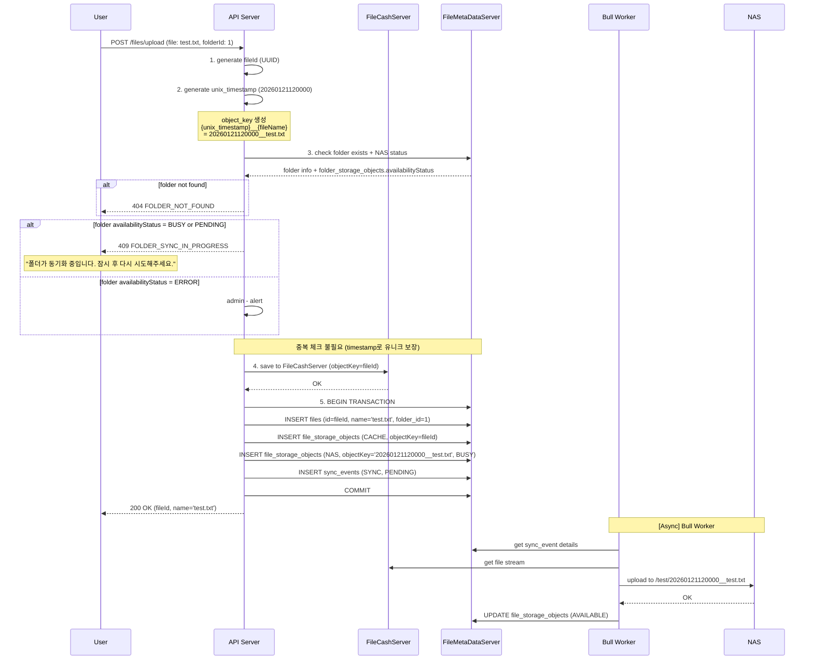
```mermaid
sequenceDiagram
    participant User as User
    participant API as API Server
    participant Cache as FileCashServer 
    participant DB as FileMetaDataServer
    participant Worker as Bull Worker
    participant NAS as NAS

    User->>API: POST /files/upload (file: test.txt, folderId: 1)
    
    API->>API: 1. generate fileId (UUID)
    API->>API: 2. generate unix_timestamp (20260121120000)
    
    Note over API: object_key 생성<br/>{unix_timestamp}__{fileName}<br/>= 20260121120000__test.txt
    
    API->>DB: 3. check folder exists + NAS status
    DB-->>API: folder info + folder_storage_objects.availabilityStatus
    
    alt folder not found
        API-->>User: 404 FOLDER_NOT_FOUND
    end
    
    alt folder availabilityStatus = BUSY or PENDING
        API-->>User: 409 FOLDER_SYNC_IN_PROGRESS
        Note over User: "폴더가 동기화 중입니다. 잠시 후 다시 시도해주세요."
    else folder availabilityStatus = ERROR
        API->>API: admin - alert
    end
    
    Note over API,DB: 중복 체크 불필요 (timestamp로 유니크 보장)
    
    API->>Cache: 4. save to FileCashServer (objectKey=fileId)
    Cache-->>API: OK
    
    API->>DB: 5. BEGIN TRANSACTION
    API->>DB: INSERT files (id=fileId, name='test.txt', folder_id=1)
    API->>DB: INSERT file_storage_objects (CACHE, objectKey=fileId)
    API->>DB: INSERT file_storage_objects (NAS, objectKey='20260121120000__test.txt', BUSY)
    API->>DB: INSERT sync_events (SYNC, PENDING)
    API->>DB: COMMIT
    
    API-->>User: 200 OK (fileId, name='test.txt')
    
    Note over Worker,NAS: [Async] Bull Worker
    Worker->>DB: get sync_event details
    Worker->>Cache: get file stream
    Worker->>NAS: upload to /test/20260121120000__test.txt
    NAS-->>Worker: OK
    Worker->>DB: UPDATE file_storage_objects (AVAILABLE)
```

---

### 6-4. 데이터 저장 예시

**동일 파일명 2회 업로드 시:**

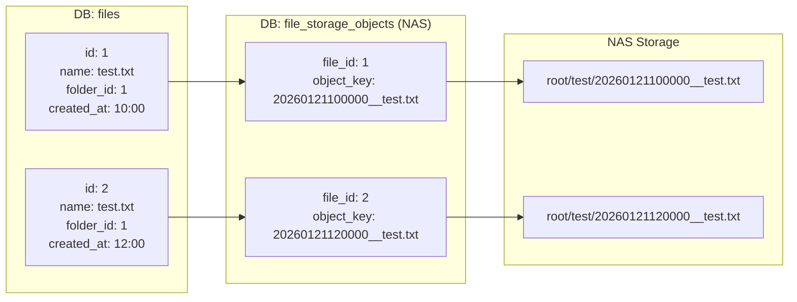
```mermaid
flowchart LR
    subgraph DB_files["DB: files"]
        F1["id: 1<br/>name: test.txt<br/>folder_id: 1<br/>created_at: 10:00"]
        F2["id: 2<br/>name: test.txt<br/>folder_id: 1<br/>created_at: 12:00"]
    end
    
    subgraph DB_storage["DB: file_storage_objects (NAS)"]
        S1["file_id: 1<br/>object_key: 20260121100000__test.txt"]
        S2["file_id: 2<br/>object_key: 20260121120000__test.txt"]
    end
    
    subgraph NAS["NAS Storage"]
        N1["root/test/20260121100000__test.txt"]
        N2["root/test/20260121120000__test.txt"]
    end
    
    F1 --> S1 --> N1
    F2 --> S2 --> N2
```

---

### 6-5. 파일 이름 변경 시 NAS object_key 처리

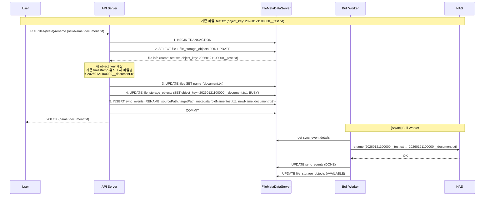
```mermaid
sequenceDiagram
    participant User as User
    participant API as API Server
    participant DB as FileMetaDataServer
    participant Worker as Bull Worker
    participant NAS as NAS

    Note over User,NAS: 기존 파일: test.txt (object_key: 20260121100000__test.txt)
    
    User->>API: PUT /files/{fileId}/rename (newName: document.txt)
    
    API->>DB: 1. BEGIN TRANSACTION
    API->>DB: 2. SELECT file + file_storage_objects FOR UPDATE
    DB-->>API: file info (name: test.txt, object_key: 20260121100000__test.txt)
    
    Note over API: 새 object_key 계산<br/>기존 timestamp 유지 + 새 파일명<br/>= 20260121100000__document.txt
    
    API->>DB: 3. UPDATE files SET name='document.txt'
    API->>DB: 4. UPDATE file_storage_objects (SET object_key='20260121100000__document.txt', BUSY)
    API->>DB: 5. INSERT sync_events (RENAME, sourcePath, targetPath, metadata:{oldName:'test.txt', newName:'document.txt'})
    API->>DB: COMMIT
    
    API-->>User: 200 OK (name: document.txt)
    
    Note over Worker,NAS: [Async] Bull Worker
    Worker->>DB: get sync_event details
    Worker->>NAS: rename (20260121100000__test.txt → 20260121100000__document.txt)
    NAS-->>Worker: OK
    Worker->>DB: UPDATE sync_events (DONE)
    Worker->>DB: UPDATE file_storage_objects (AVAILABLE)
```

**핵심:** 파일명 변경 시에도 **원본 timestamp는 유지**하고 파일명 부분만 변경

---

### 6-6. 파일 이동 시 NAS object_key 처리

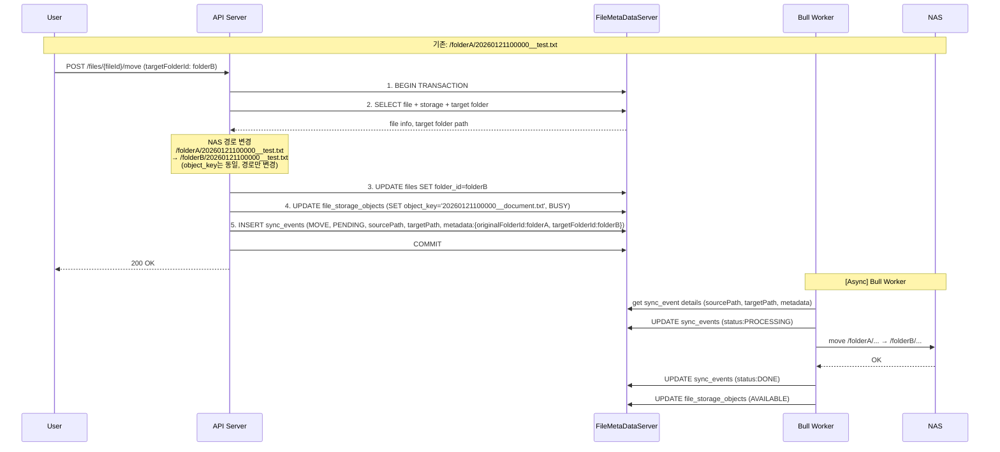
```mermaid
sequenceDiagram
    participant User as User
    participant API as API Server
    participant DB as FileMetaDataServer
    participant Worker as Bull Worker
    participant NAS as NAS

    Note over User,NAS: 기존: /folderA/20260121100000__test.txt
    
    User->>API: POST /files/{fileId}/move (targetFolderId: folderB)
    
    API->>DB: 1. BEGIN TRANSACTION
    API->>DB: 2. SELECT file + storage + target folder
    DB-->>API: file info, target folder path
    
    Note over API: NAS 경로 변경<br/>/folderA/20260121100000__test.txt<br/>→ /folderB/20260121100000__test.txt<br/>(object_key는 동일, 경로만 변경)
    
    API->>DB: 3. UPDATE files SET folder_id=folderB
    API->>DB: 4. UPDATE file_storage_objects (SET object_key='20260121100000__document.txt', BUSY)
    API->>DB: 5. INSERT sync_events (MOVE, PENDING, sourcePath, targetPath, metadata:{originalFolderId:folderA, targetFolderId:folderB})
    API->>DB: COMMIT
    
    API-->>User: 200 OK
    
    Note over Worker,NAS: [Async] Bull Worker
    Worker->>DB: get sync_event details (sourcePath, targetPath, metadata)
    Worker->>DB: UPDATE sync_events (status:PROCESSING)
    Worker->>NAS: move /folderA/... → /folderB/...
    NAS-->>Worker: OK

    Worker->>DB: UPDATE sync_events (status:DONE)
    Worker->>DB: UPDATE file_storage_objects (AVAILABLE)
```

**핵심:** 폴더 이동 시 **object_key(파일명)는 그대로**, NAS 경로만 변경

---

### 6-7. object_key 생성 규칙 요약

| 작업 | object_key 처리 |
|------|----------------|
| **신규 업로드** | `{현재_timestamp}__{fileName}` 생성 |
| **파일명 변경** | `{기존_timestamp}__{newFileName}` (timestamp 유지) |
| **파일 이동** | object_key 동일, NAS 경로만 변경 |
| **파일 복사** | `{현재_timestamp}__{fileName}` 신규 생성 |

---

## 참고

- [005.파일.md](./005.파일.md) - API 상세 정의
- [005-2.파일명중복전략.md](./005-2.파일명중복전략.md) - 파일명 중복 처리 상세
- [001.정의.md](../001.정의.md) - 공통 사항
- [050.큐관리.md](../050.큐관리.md) - Bull 큐 관리
