# 005-3. 파일 단위 큐 NAS 동기화

파일(문서) 단위로 큐를 관리하여 NAS 동기화를 처리하는 방식의 시퀀스 다이어그램

---

## 개요

### 기존 방식 vs 파일 단위 큐 방식

```
기존 방식 (작업 레벨):
  sync_events: [MOVE(a,1→2), DELETE(a,2), MOVE(b,1→3)]
  → 순서 보장 어려움, 락 경합 발생 가능

파일 단위 큐 방식:
  queue(fileId=a): MOVE(1→2) → DELETE
  queue(fileId=b): MOVE(1→3)
  → 파일별 순차 처리, 파일 간 병렬 처리
```

---

## 1. 기본 구조

### 1-1. 파일 단위 큐 아키텍처

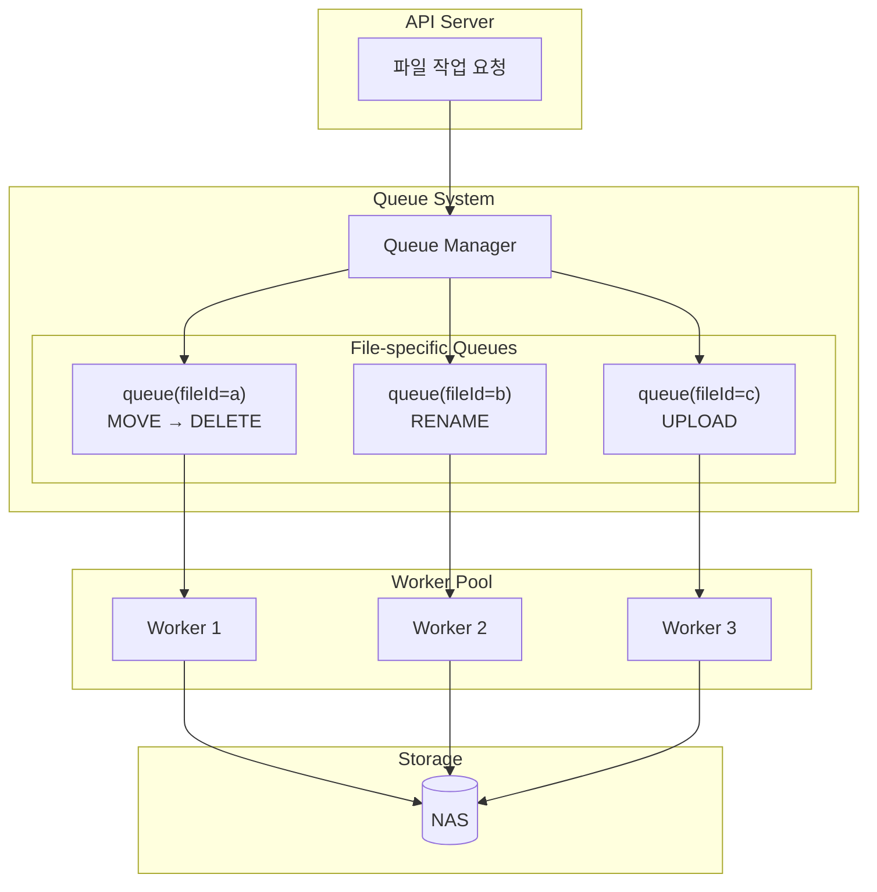

---

## 2. 단일 파일 작업

### 2-1. 파일 업로드 → NAS 동기화

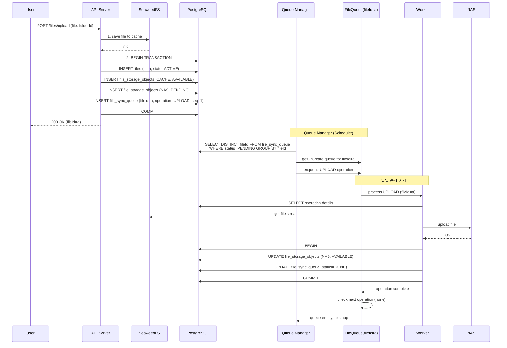

---

### 2-2. 파일 이름 변경

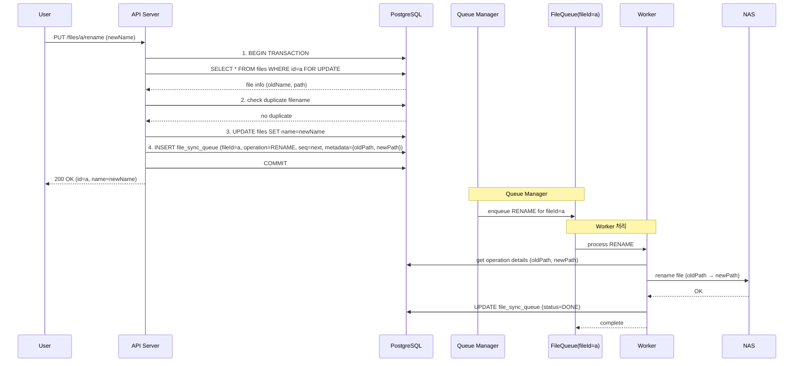

---

## 3. 연속 작업 (핵심 케이스)

### 3-1. 이동 → 삭제 (Move then Delete)

```mermaid
sequenceDiagram
    participant User as User
    participant API as API Server
    participant DB as PostgreSQL
    participant QM as Queue Manager
    participant FQ as FileQueue(fileId=a)
    participant Worker as Worker
    participant NAS as NAS

    Note over User,API: 1단계: 파일 이동 요청
    User->>API: POST /files/a/move (targetFolderId=2)
    
    API->>DB: BEGIN TRANSACTION
    API->>DB: UPDATE files SET folderId=2
    API->>DB: INSERT file_sync_queue (fileId=a, op=MOVE, seq=1)
    API->>DB: COMMIT
    
    API-->>User: 200 OK (syncQueueId=101)
    
    Note over User,API: 2단계: 바로 삭제 요청 (이동 완료 전)
    User->>API: DELETE /files/a
    
    API->>DB: BEGIN TRANSACTION
    API->>DB: UPDATE files SET state=TRASHED
    API->>DB: INSERT file_sync_queue (fileId=a, op=TRASH, seq=2)
    API->>DB: COMMIT
    
    API-->>User: 200 OK (syncQueueId=102)
    
    Note over QM,FQ: Queue Manager - 파일별 큐 생성
    QM->>DB: SELECT * FROM file_sync_queue<br/>WHERE fileId=a ORDER BY seq
    DB-->>QM: [MOVE(seq=1), TRASH(seq=2)]
    QM->>FQ: create queue with ordered operations
    
    Note over FQ,NAS: 순차 처리 보장
    rect rgb(57, 59, 57)
        Note over FQ,NAS: Operation 1: MOVE
        FQ->>Worker: process MOVE (seq=1)
        Worker->>NAS: move file (folder1 → folder2)
        NAS-->>Worker: OK
        Worker->>DB: UPDATE file_sync_queue SET status=DONE WHERE seq=1
        Worker-->>FQ: MOVE complete
    end
    
    rect rgb(57, 59, 57)
        Note over FQ,NAS: Operation 2: TRASH (이전 작업 완료 후)
        FQ->>Worker: process TRASH (seq=2)
        Worker->>NAS: move file to .trash/ (from folder2!)
        NAS-->>Worker: OK
        Worker->>DB: UPDATE file_sync_queue SET status=DONE WHERE seq=2
        Worker-->>FQ: TRASH complete
    end
    
    FQ->>QM: all operations done, cleanup queue
```

---

### 3-2. 업로드 → 이름변경 → 이동 (연속 3개 작업)

```mermaid
sequenceDiagram
    participant User as User
    participant API as API Server
    participant DB as PostgreSQL
    participant FQ as FileQueue(fileId=a)
    participant Worker as Worker
    participant NAS as NAS

    Note over User,DB: 빠른 연속 요청
    User->>API: POST /files/upload
    API->>DB: INSERT file_sync_queue (op=UPLOAD, seq=1)
    API-->>User: 200 OK
    
    User->>API: PUT /files/a/rename
    API->>DB: INSERT file_sync_queue (op=RENAME, seq=2)
    API-->>User: 200 OK
    
    User->>API: POST /files/a/move
    API->>DB: INSERT file_sync_queue (op=MOVE, seq=3)
    API-->>User: 200 OK
    
    Note over FQ,NAS: 파일 큐 - 순차 처리
    
    rect rgb(57, 59, 57)
        Note over FQ,NAS: Step 1: UPLOAD
        FQ->>Worker: process UPLOAD
        Worker->>NAS: upload to /folder1/fileA.txt
        NAS-->>Worker: OK
        Worker-->>FQ: done
    end
    
    rect rgb(57, 59, 57)
        Note over FQ,NAS: Step 2: RENAME (UPLOAD 완료 후)
        FQ->>Worker: process RENAME
        Worker->>NAS: rename fileA.txt → fileB.txt
        NAS-->>Worker: OK
        Worker-->>FQ: done
    end
    
    rect rgb(57, 59, 57)
        Note over FQ,NAS: Step 3: MOVE (RENAME 완료 후)
        FQ->>Worker: process MOVE
        Worker->>NAS: move /folder1/fileB.txt → /folder2/fileB.txt
        NAS-->>Worker: OK
        Worker-->>FQ: done
    end
```

---

## 4. 병렬 처리 (다중 파일)

### 4-1. 서로 다른 파일 동시 처리

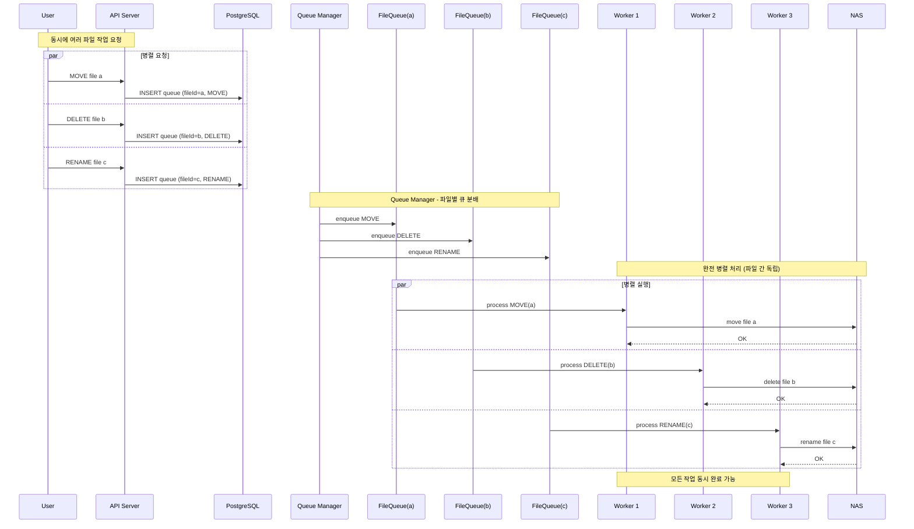

---

### 4-2. 폴더 이동 (하위 파일 일괄 처리)

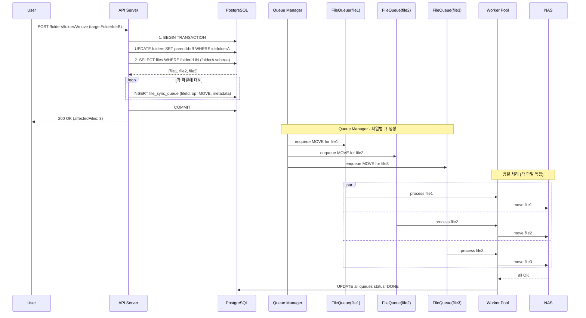

---

## 5. 에러 처리

### 5-1. 작업 실패 및 재시도

```mermaid
sequenceDiagram
    participant FQ as FileQueue(fileId=a)
    participant Worker as Worker
    participant DB as PostgreSQL
    participant NAS as NAS
    participant Alert as Alert System

    Note over FQ,Worker: 큐에 [MOVE, DELETE] 작업 존재
    
    rect rgb(77, 65, 65)
        Note over FQ,NAS: MOVE 작업 - 첫 번째 시도 실패
        FQ->>Worker: process MOVE (attempt=1)
        Worker->>NAS: move file
        NAS-->>Worker: Error (network timeout)
        
        Worker->>DB: UPDATE file_sync_queue<br/>SET retry_count=1, error_message='timeout'
        Worker-->>FQ: retry needed
        
        FQ->>FQ: wait (backoff: 5s)
    end
    
    rect rgb(77, 65, 65)
        Note over FQ,NAS: MOVE 작업 - 두 번째 시도 실패
        FQ->>Worker: process MOVE (attempt=2)
        Worker->>NAS: move file
        NAS-->>Worker: Error (network timeout)
        
        Worker->>DB: UPDATE retry_count=2
        Worker-->>FQ: retry needed
        
        FQ->>FQ: wait (backoff: 10s)
    end
    
    rect rgb(77, 65, 65)
        Note over FQ,NAS: MOVE 작업 - 세 번째 시도 성공
        FQ->>Worker: process MOVE (attempt=3)
        Worker->>NAS: move file
        NAS-->>Worker: OK
        
        Worker->>DB: UPDATE status=DONE, retry_count=0
        Worker-->>FQ: MOVE complete
    end
    
    rect rgb(77, 65, 65)
        Note over FQ,NAS: DELETE 작업 - 이전 성공 후 진행
        FQ->>Worker: process DELETE
        Worker->>NAS: delete file
        NAS-->>Worker: OK
        Worker-->>FQ: DELETE complete
    end
```

---

### 5-2. 최대 재시도 초과 시 처리

```mermaid
sequenceDiagram
    participant FQ as FileQueue(fileId=a)
    participant Worker as Worker
    participant DB as PostgreSQL
    participant NAS as NAS
    participant Alert as Alert System
    participant Admin as Admin

    Note over FQ,Worker: MOVE 작업 반복 실패
    
    loop 재시도 (max=5)
        FQ->>Worker: process MOVE
        Worker->>NAS: move file
        NAS-->>Worker: Error
        Worker->>DB: UPDATE retry_count++
        Worker-->>FQ: retry
    end
    
    rect rgb(77, 65, 65)
        Note over FQ,Alert: 최대 재시도 초과
        FQ->>Worker: process MOVE (attempt=6)
        Worker->>NAS: move file
        NAS-->>Worker: Error
        
        Worker->>DB: BEGIN
        Worker->>DB: UPDATE file_sync_queue SET status=FAILED
        Worker->>DB: UPDATE file_storage_objects SET availability_status=ERROR
        Worker->>DB: COMMIT
        
        Worker->>Alert: send alert (fileId=a, operation=MOVE, error)
        Alert->>Admin: notification
    end
    
    Note over FQ,DB: 후속 작업 처리 전략
    
    alt 전략 1: 후속 작업 모두 취소
        FQ->>DB: UPDATE file_sync_queue<br/>SET status=CANCELLED<br/>WHERE fileId=a AND seq > failed_seq
        FQ->>FQ: cleanup queue
    else 전략 2: 후속 작업 대기 (수동 개입)
        FQ->>FQ: pause queue
        Admin->>API: POST /admin/sync-queue/a/retry
        API->>FQ: resume from failed operation
    else 전략 3: 후속 작업 건너뛰기
        FQ->>DB: UPDATE SET status=SKIPPED WHERE seq=failed
        FQ->>Worker: process next operation (DELETE)
        Note over Worker: 주의: 이전 상태 기반으로 실행
    end
```

---

## 6. 특수 케이스

### 6-1. 작업 중 새 작업 추가

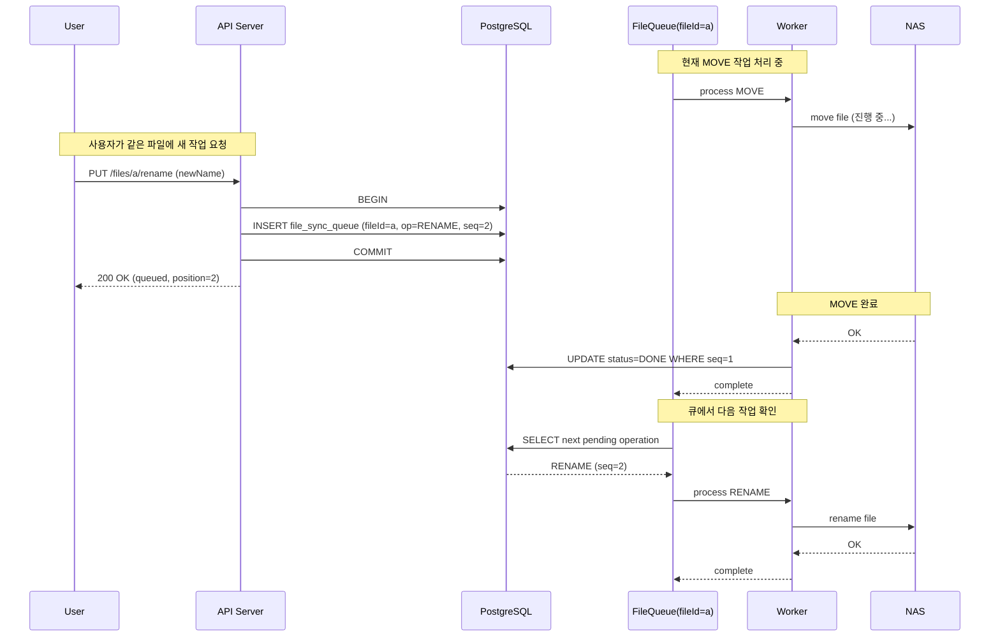

---

### 6-2. 동일 파일 동시 API 요청 (Race Condition 방지)

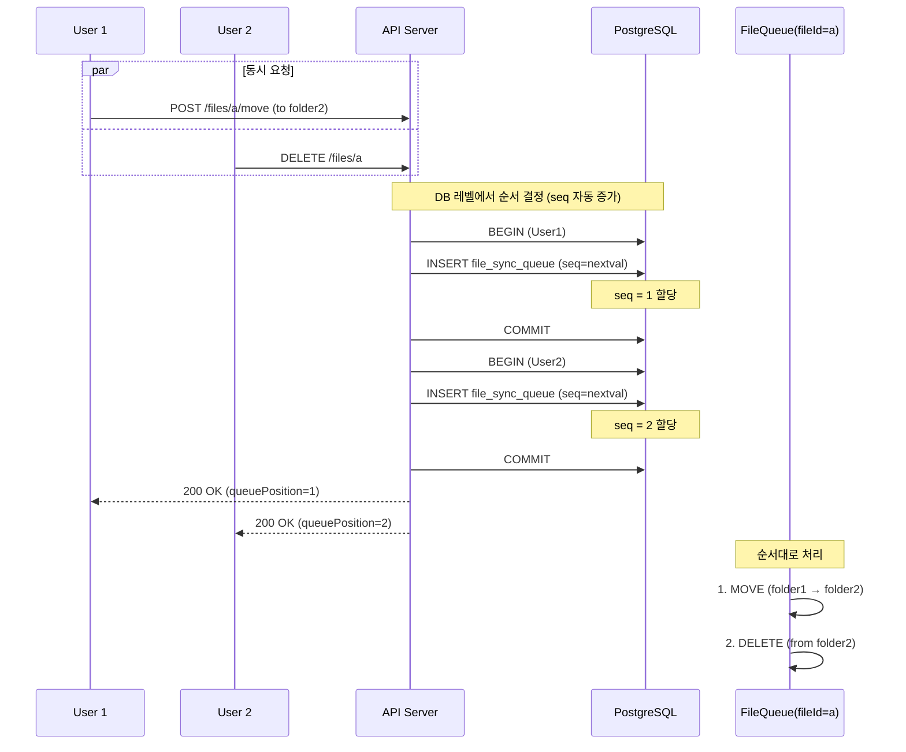

---

### 6-3. 큐 상태 조회 API

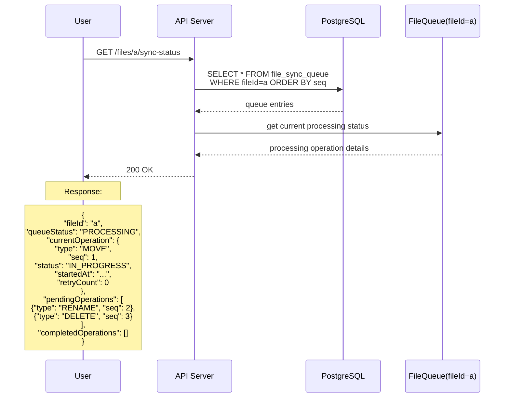

---

## 7. 데이터 모델

### 7-1. file_sync_queue 테이블 구조

```sql
CREATE TABLE file_sync_queue (
    id UUID PRIMARY KEY DEFAULT gen_random_uuid(),
    file_id UUID NOT NULL REFERENCES files(id),
    folder_id UUID REFERENCES folders(id),  -- 폴더 작업용
    
    -- 작업 정보
    operation_type VARCHAR(20) NOT NULL,  -- UPLOAD, MOVE, RENAME, TRASH, DELETE, RESTORE
    seq INTEGER NOT NULL,                  -- 파일별 순서 번호
    
    -- 메타데이터
    metadata JSONB,  -- {sourcePath, targetPath, oldName, newName, etc.}
    
    -- 상태 관리
    status VARCHAR(20) DEFAULT 'PENDING',  -- PENDING, PROCESSING, DONE, FAILED, CANCELLED
    retry_count INTEGER DEFAULT 0,
    max_retries INTEGER DEFAULT 5,
    error_message TEXT,
    
    -- 타임스탬프
    created_at TIMESTAMP DEFAULT NOW(),
    started_at TIMESTAMP,
    completed_at TIMESTAMP,
    
    -- 인덱스용
    UNIQUE(file_id, seq)
);

-- 인덱스
CREATE INDEX idx_sync_queue_file_status ON file_sync_queue(file_id, status);
CREATE INDEX idx_sync_queue_pending ON file_sync_queue(status) WHERE status = 'PENDING';
```

---

## 8. 폴더 삭제 처리

> **정책:** 폴더 안에 파일 또는 하위 폴더가 있는 경우 삭제 불가 (빈 폴더만 삭제 가능)

### 8-1. 폴더 삭제 FLOW

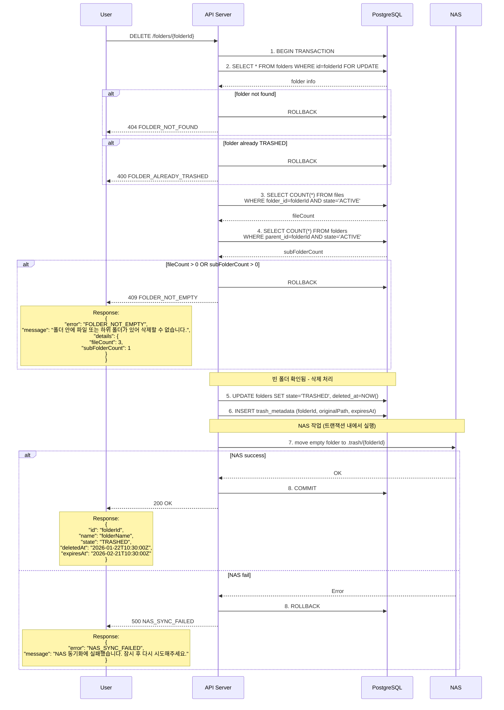

---

### 8-2. 폴더 삭제 Flowchart

```mermaid
flowchart TD
    A[DELETE /folders/folderId] --> B[BEGIN TRANSACTION]
    B --> C{폴더 존재?}
    C -->|No| D[ROLLBACK]
    D --> E[404 FOLDER_NOT_FOUND]
    C -->|Yes| F{이미 삭제됨?}
    F -->|Yes| G[ROLLBACK]
    G --> H[400 FOLDER_ALREADY_TRASHED]
    F -->|No| I{하위 파일 존재?}
    I -->|Yes| J[ROLLBACK]
    J --> K[409 FOLDER_NOT_EMPTY]
    I -->|No| L{하위 폴더 존재?}
    L -->|Yes| J
    L -->|No| M[빈 폴더 확인]
    M --> N[DB: state='TRASHED']
    N --> O[NAS: move to .trash/]
    O --> P{NAS 성공?}
    P -->|Yes| Q[COMMIT]
    Q --> R[200 OK]
    P -->|No| S[ROLLBACK]
    S --> T[500 NAS_SYNC_FAILED]
    
    style E fill:#000000
    style H fill:#000000
    style K fill:#000000
    style T fill:#000000
    style R fill:#000000
```

---

### 8-3. 에러 응답 정의

| HTTP Status | Error Code | 설명 |
|-------------|------------|------|
| 404 | FOLDER_NOT_FOUND | 폴더가 존재하지 않음 |
| 400 | FOLDER_ALREADY_TRASHED | 이미 휴지통에 있는 폴더 |
| 409 | FOLDER_NOT_EMPTY | 폴더 안에 파일 또는 하위 폴더 존재 |
| 500 | NAS_SYNC_FAILED | NAS 동기화 실패 (재시도 필요) |

**FOLDER_NOT_EMPTY 에러 응답 예시:**

```json
{
  "statusCode": 409,
  "error": "FOLDER_NOT_EMPTY",
  "message": "폴더 안에 파일 또는 하위 폴더가 있어 삭제할 수 없습니다. 먼저 내부 항목을 삭제해주세요.",
  "details": {
    "folderId": "uuid-folder-id",
    "folderName": "Documents",
    "fileCount": 5,
    "subFolderCount": 2
  }
}
```

**NAS_SYNC_FAILED 에러 응답 예시:**

```json
{
  "statusCode": 500,
  "error": "NAS_SYNC_FAILED",
  "message": "NAS 동기화에 실패했습니다. 잠시 후 다시 시도해주세요.",
  "details": {
    "folderId": "uuid-folder-id",
    "folderName": "Documents"
  }
}
```

---

### 8-4. 정책 요약

| 케이스 | 처리 결과 |
|--------|----------|
| 빈 폴더 삭제 | ✅ 즉시 삭제 (휴지통 이동) |
| 파일이 있는 폴더 삭제 | ❌ 409 에러 반환 |
| 하위 폴더가 있는 폴더 삭제 | ❌ 409 에러 반환 |
| 파일 + 하위 폴더 모두 있는 폴더 삭제 | ❌ 409 에러 반환 |

**사용자 가이드:**
1. 폴더를 삭제하려면 먼저 내부의 모든 파일과 하위 폴더를 삭제해야 합니다.
2. 재귀적 삭제가 필요한 경우 클라이언트에서 하위 항목부터 순차적으로 삭제 요청을 보내야 합니다.

---

## 9. 장점 요약

| 항목 | 기존 방식 | 파일 단위 큐 |
|------|----------|-------------|
| 순서 보장 | △ (락 필요) | ◎ (자동) |
| 동시성 안전 | △ (충돌 가능) | ◎ (원천 차단) |
| 병렬 처리 | △ (제한적) | ◎ (파일 간 완전 병렬) |
| 에러 추적 | △ | ◎ (파일별 상태) |
| 복잡도 | ○ | △ (큐 관리 필요) |

---

## 10. 참고

- [005-1.파일_처리_FLOW.md](./005-1.파일_처리_FLOW.md) - 기존 파일 처리 FLOW
- [005-2.파일명중복전략.md](./005-2.파일명중복전략.md) - 파일명 중복 처리 전략
- [050.큐관리.md](./050.큐관리.md) - Bull 큐 관리
