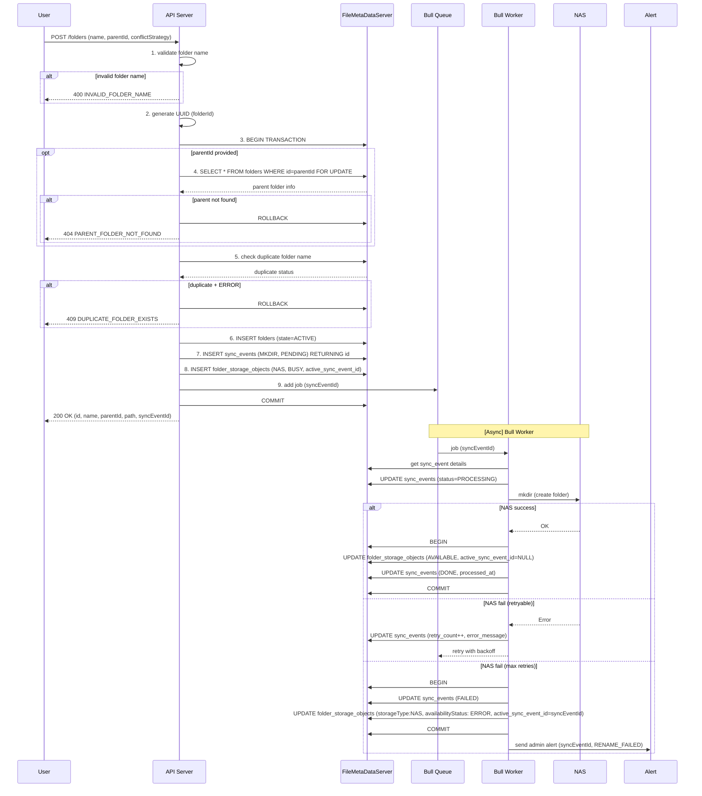
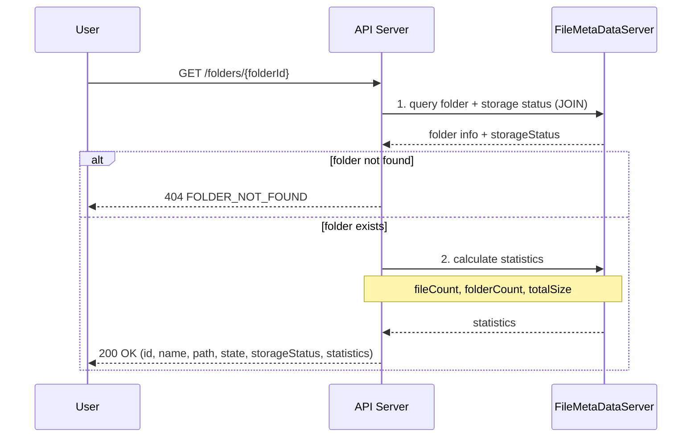
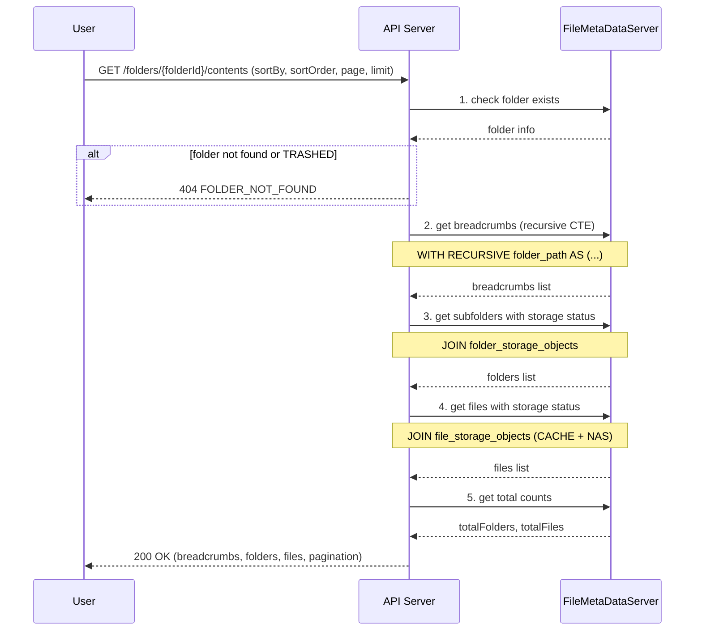
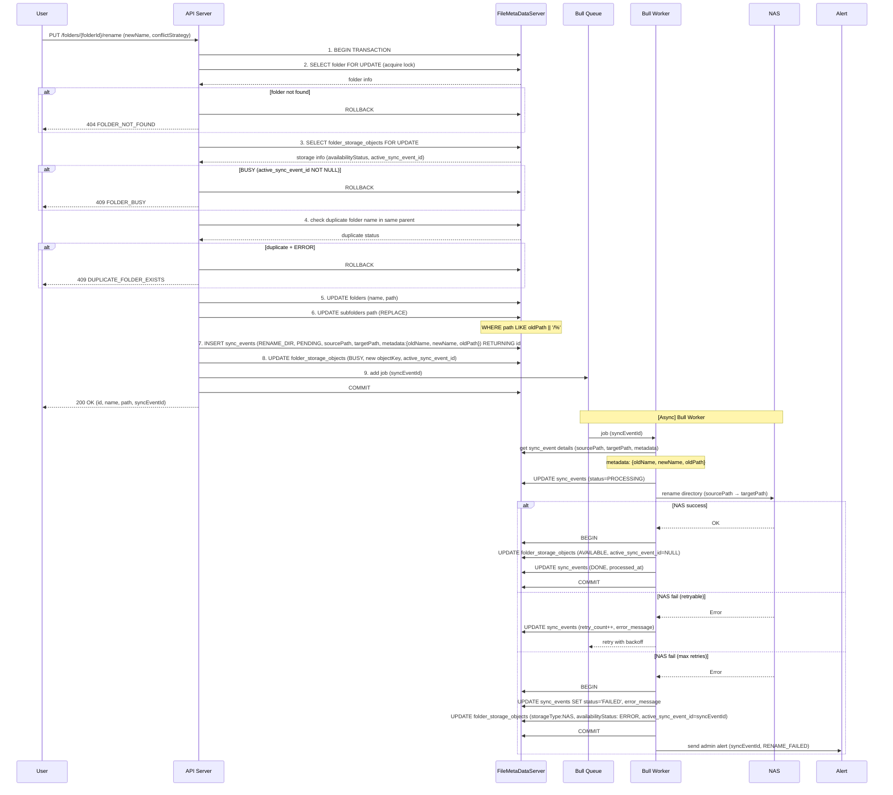
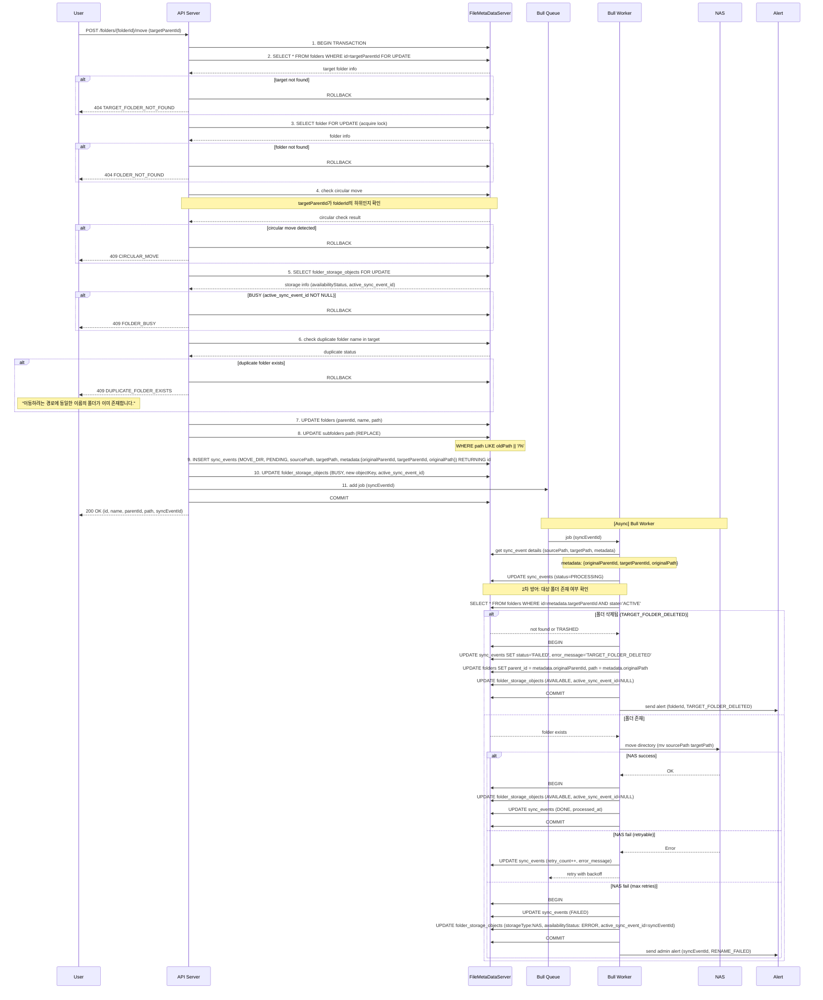
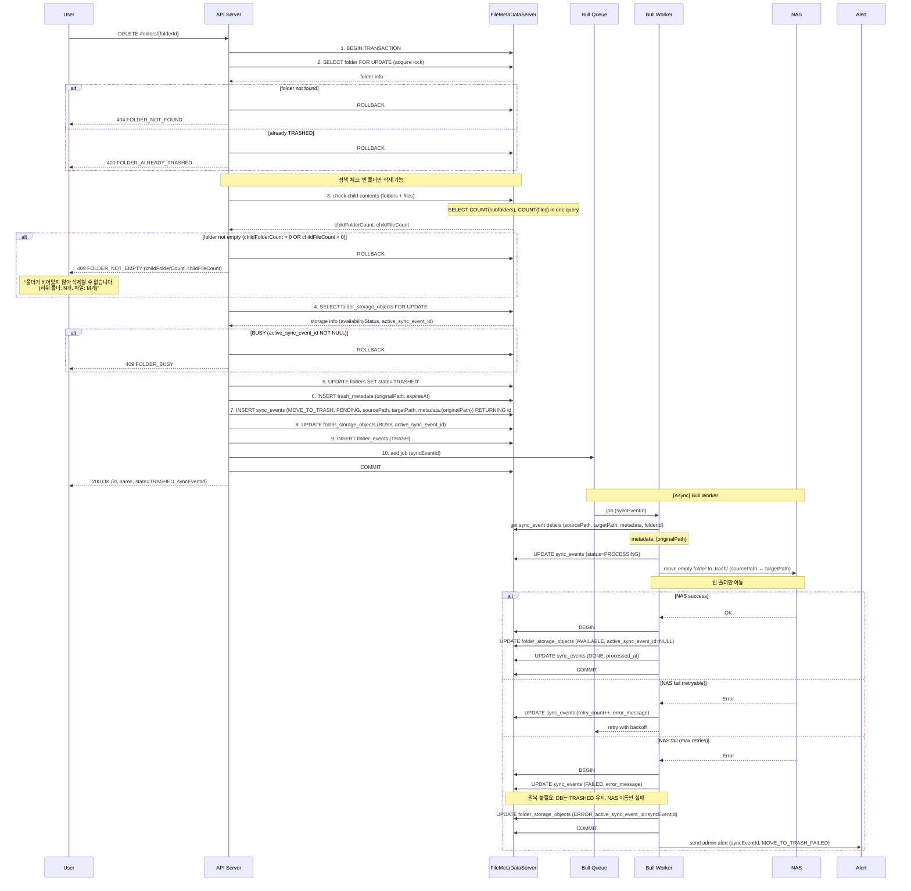
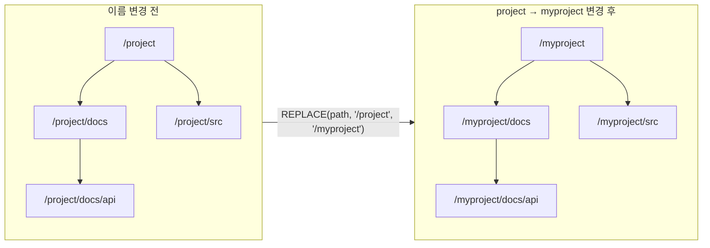
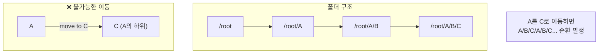
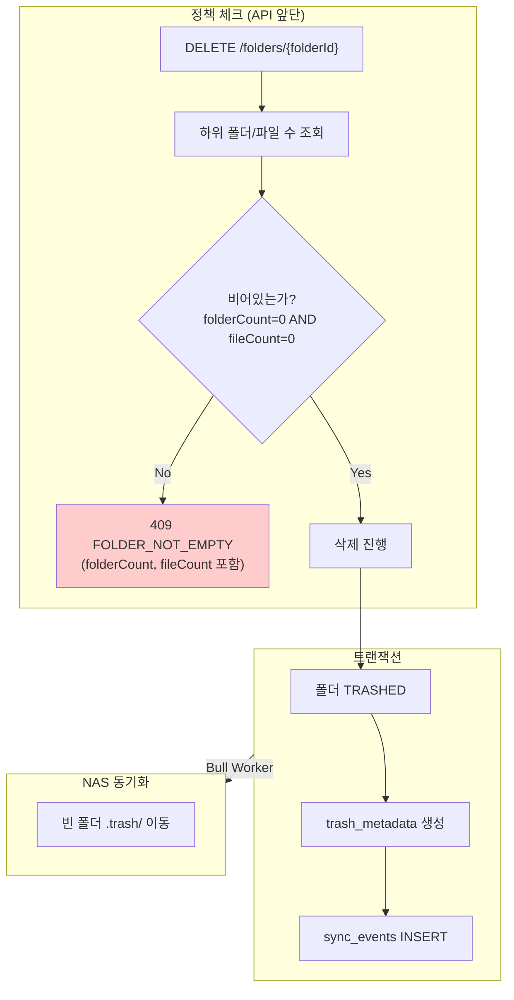

# 008-1. 폴더 처리 FLOW

폴더 관련 API의 시퀀스 다이어그램

---

## 1. 폴더 생성

### 1-1. POST /folders - 폴더 생성



---

## 2. 폴더 조회

### 2-1. GET /folders/{folderId} - 폴더 정보 조회



---

### 2-2. GET /folders/{folderId}/contents - 폴더 내용 조회



---

## 3. 폴더 수정

### 3-1. PUT /folders/{folderId}/rename - 폴더명 변경



> **원복 처리:** NAS 이름 변경 최종 실패 시, DB에 저장된 새 이름/경로를 원래 이름/경로로 복구하여 DB-NAS 정합성 유지

---

### 3-2. POST /folders/{folderId}/move - 폴더 이동



---

## 4. 폴더 삭제

> **정책:** 폴더 안에 파일 또는 하위 폴더가 있으면 삭제 불가 (빈 폴더만 삭제 가능)

### 4-1. DELETE /folders/{folderId} - 폴더 삭제 (휴지통)



```
GET /sync-events/{syncEventId}
→ { id, eventType, status, retryCount, errorMessage, createdAt, processedAt }

GET /folders/{folderId}/sync-status
→ folder_storage_objects.availability_status + active sync_event details
```

---

## 5. 폴더 처리 시 주의사항

### 5-1. 하위 경로 일괄 업데이트



### 5-2. 순환 이동 방지



**순환 체크 쿼리:**
```sql
SELECT * FROM folders 
WHERE id = :targetParentId 
  AND path LIKE (SELECT path FROM folders WHERE id = :folderId) || '/%';
```

### 5-3. 폴더 삭제 정책

> **정책:** 빈 폴더만 삭제 가능 (하위 파일/폴더가 있으면 삭제 불가)



**폴더 삭제 실패 시 사용자 안내:**
- 응답: `409 FOLDER_NOT_EMPTY { childFolderCount: N, childFileCount: M }`
- 메시지: "폴더가 비어있지 않아 삭제할 수 없습니다. (하위 폴더: N개, 파일: M개)"

---

## 참고

- [008.폴더.md](./008.폴더.md) - API 상세 정의
- [005-1.파일_처리_FLOW.md](../파일/005-1.파일_처리_FLOW.md) - 파일 처리 FLOW
- [001.정의.md](../001.정의.md) - 공통 사항
- [050.큐관리.md](../050.큐관리.md) - Bull 큐 관리
- [060.휴지통.md](../060.휴지통_version0.0.2.md) - 휴지통 상세 플로우
- [061.휴지통_비동기처리.md](../061.휴지통_비동기처리.md) - 휴지통 비동기 처리
