# 060-1. 휴지통 처리 FLOW

휴지통 관련 API의 시퀀스 다이어그램

---

## 정책

> **⚠️ 핵심 정책**
> 
> | 항목 | 정책 |
> |------|------|
> | **휴지통 대상** | **파일만** 휴지통 이동 가능 (폴더는 휴지통 이동 불가) |
> | **폴더 삭제** | 빈 폴더만 즉시 영구삭제 (하위 파일/폴더 있으면 삭제 불가) |
> | **휴지통 방식** | 윈도우 휴지통 스타일 - 플랫 리스트, 원래 위치로 복원 |
> | **자동 삭제** | 휴지통 이동 후 30일 경과 시 자동 영구삭제 |
>
> **📁 복구 정책 (2단계 프로세스)**
> 
> | 단계 | 설명 |
> |------|------|
> | **1단계 (Preview)** | `POST /trash/restore/preview` - 선택 파일들의 경로 상태 확인 |
> | **2단계 (Execute)** | `POST /trash/restore/execute` - 경로 세팅 완료 후 실제 복구 실행 |
>
> | 상황 | 처리 |
> |------|------|
> | **경로 판단 기준** | **경로명 기준** (폴더 ID가 아님) - 동일 경로명의 폴더가 있으면 복구 가능 |
> | **충돌 정의** | 파일이름 + mimeType + 생성시간이 **모두 동일**한 경우만 충돌 |
> | **충돌 발생 시** | 관리자 알림, 복구에서 제외 (자동 복구 불가) |
> | **원래 경로 있음** | 원래 경로로 자동 복구 (또는 사용자 지정 경로) |
> | **원래 경로 없음** | 사용자가 복구 경로 지정 필수 (미지정 시 복구 불가) |
>
> **경로명 기준 복구 예시:**
> ```
> ① 파일 삭제: /project/folder(ID:3)/file.txt → 휴지통
> ② 폴더 삭제: /project/folder(ID:3)/ 삭제
> ③ 새 폴더 생성: /project/folder(ID:4)/ (같은 경로명)
> ④ 복구 시: 경로명 "/project/folder/"가 존재 → AVAILABLE (ID:4로 자동 복구)
> ```

---

## 1. 휴지통 조회

### 1-1. GET /trash - 휴지통 목록 조회 (필터 지원)

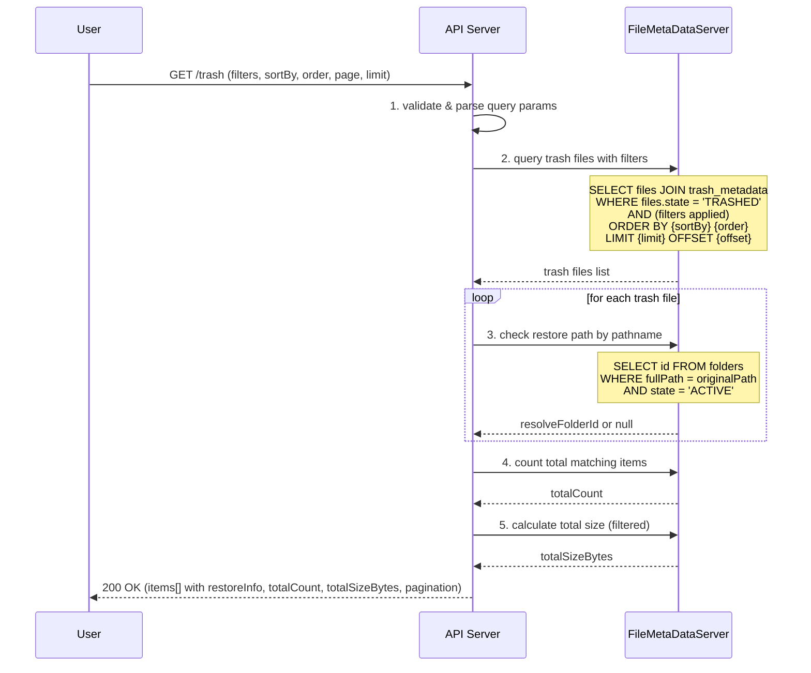

**요청 Query Parameters:**
```typescript
interface TrashListQuery {
  // === 페이지네이션 ===
  page?: number;              // 페이지 번호 (default: 1)
  limit?: number;             // 페이지 당 항목 수 (default: 20, max: 100)
  
  // === 정렬 ===
  sortBy?: 'name' | 'sizeBytes' | 'mimeType' | 'deletedAt' | 'expiresAt' | 'deletedBy';  // default: deletedAt
  order?: 'asc' | 'desc';     // default: desc
  
  // === 검색 ===
  search?: string;            // 파일명 검색 (부분 일치, 대소문자 무시)
  
  // === 필터 ===
  mimeType?: string;          // MIME 타입 필터 (예: 'image/*', 'application/pdf')
  mimeCategory?: 'image' | 'video' | 'audio' | 'document' | 'archive' | 'other';  // MIME 카테고리
  
  deletedBy?: string;         // 삭제자 ID
  
  deletedAfter?: string;      // 삭제일 시작 (ISO 8601, 예: '2026-01-01')
  deletedBefore?: string;     // 삭제일 종료 (ISO 8601)
  
  expiresAfter?: string;      // 만료일 시작 (ISO 8601)
  expiresBefore?: string;     // 만료일 종료 (ISO 8601)
  
  minSize?: number;           // 최소 파일 크기 (bytes)
  maxSize?: number;           // 최대 파일 크기 (bytes)
  
  originalFolderId?: string;  // 원래 폴더 ID (특정 폴더에서 삭제된 파일만)
}
```

**응답 구조:**
```typescript
interface TrashListResponse {
  items: TrashItem[];
  totalCount: number;
  totalSizeBytes: number;
  
  // 페이지네이션 정보
  pagination: {
    page: number;
    limit: number;
    totalPages: number;
    hasNext: boolean;
    hasPrev: boolean;
  };
  
  // 적용된 필터 요약
  appliedFilters: {
    search?: string;
    mimeType?: string;
    mimeCategory?: string;
    deletedBy?: string;
    dateRange?: { from?: string; to?: string };
    sizeRange?: { min?: number; max?: number };
  };
}

interface TrashItem {
  type: 'FILE';
  id: string;                  // 파일 ID
  name: string;                // 파일명
  sizeBytes: number;           // 파일 크기
  mimeType: string;            // MIME 타입
  extension: string;           // 확장자 (예: 'pdf', 'jpg')
  
  trashMetadataId: string;     // 휴지통 메타 ID
  originalPath: string;        // 원래 경로 (폴더 경로)
  originalFolderId: string;    // 원래 폴더 ID (삭제 시점의 폴더 ID)
  originalFolderName: string;  // 원래 폴더명
  
  deletedAt: Date;             // 삭제일시
  deletedBy: string;           // 삭제자 ID
  deletedByName: string;       // 삭제자 이름
  expiresAt: Date;             // 자동 영구삭제 예정일
  daysUntilExpiry: number;     // 만료까지 남은 일수
  
  createdAt: Date;             // 파일 생성일 (충돌 판단용)
  
  // ★ 복구 경로 상태 (경로명 기준)
  restoreInfo: {
    pathStatus: 'AVAILABLE' | 'NOT_FOUND';  //AVAILABLE: 복구가능,NOT_FOUND : 복구 불가  복구 경로 상태
    resolveFolderId: string | null;         // 경로명으로 찾은 현재 폴더 ID (있으면)
  };
}
```

---

### 1-2. MIME 카테고리 정의

| mimeCategory | 포함 MIME 타입 |
|--------------|---------------|
| `image` | image/* (jpeg, png, gif, webp, svg...) |
| `video` | video/* (mp4, avi, mov, mkv...) |
| `audio` | audio/* (mp3, wav, flac, ogg...) |
| `document` | application/pdf, application/msword, text/*, application/vnd.ms-*, application/vnd.openxmlformats-* |
| `archive` | application/zip, application/x-rar, application/x-7z-compressed, application/gzip |
| `other` | 위 카테고리에 해당하지 않는 모든 타입 |

---

### 1-3. 필터 조합 예시

**예시 1: 최근 7일간 삭제된 이미지 파일**
```
GET /trash?mimeCategory=image&deletedAfter=2026-01-15&sortBy=deletedAt&order=desc
```

**예시 2: 특정 사용자가 삭제한 큰 파일 (10MB 이상)**
```
GET /trash?deletedBy=user123&minSize=10485760&sortBy=sizeBytes&order=desc
```

**예시 3: 파일명 검색 + PDF 문서만**
```
GET /trash?search=보고서&mimeType=application/pdf
```

**예시 4: 곧 만료되는 파일 (7일 이내)**
```
GET /trash?expiresBefore=2026-01-29&sortBy=expiresAt&order=asc
```

**예시 5: 특정 폴더에서 삭제된 파일**
```
GET /trash?originalFolderId=folder-uuid-123
```


## 2. 파일 휴지통 이동

> **⚠️ trash_metadata 생성 규칙**
> 
> | 규칙 | 설명 |
> |------|------|
> | **파일 1개 = trash_metadata 1개** | 파일 삭제 시 해당 파일에 대한 trash_metadata가 **개별 생성** |
> | **파일:trash_metadata = 1:1** | 하나의 파일은 하나의 trash_metadata만 가짐 |
> | **휴지통 ID 기준 NAS 경로** | `/.trash/{trashMetadataId}/...` 형식으로 NAS에 저장 |

### 2-1. DELETE /files/{fileId} - 파일 휴지통 이동

> **참조:** 상세 FLOW는 [005-1.파일_처리_FLOW.md](../파일/005-1.파일_처리_FLOW.md) 4-1절 참조

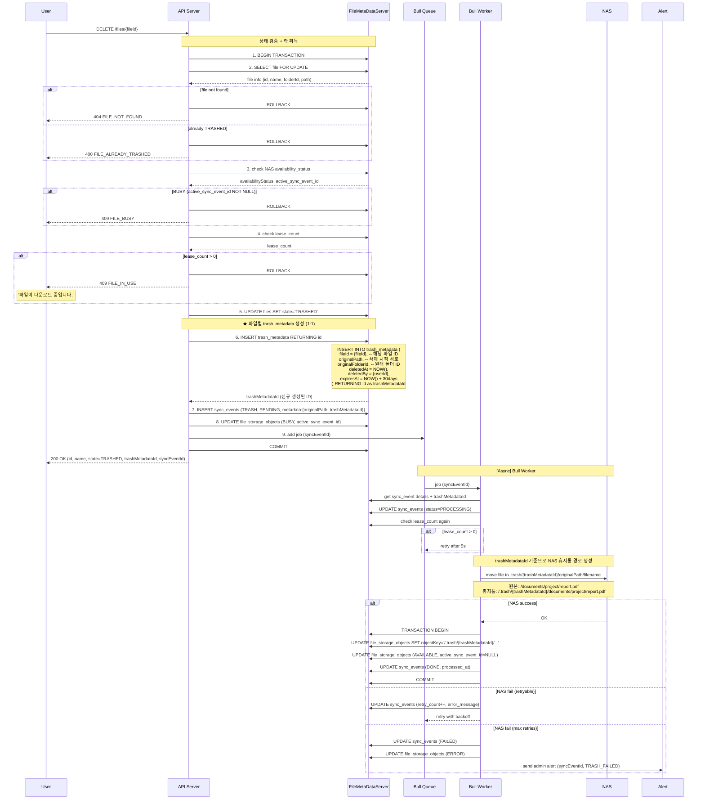

**trash_metadata 테이블 구조:**
```typescript
interface TrashMetadata {
  id: string;                // PK, UUID (trashMetadataId)
  fileId: string;            // FK → files.id (1:1 관계)
  
  originalPath: string;      // 삭제 시점의 파일 경로 (복구용)
  originalFolderId: string;  // 삭제 시점의 폴더 ID (복구용)
  
  deletedAt: Date;           // 삭제 일시
  deletedBy: string;         // 삭제자 ID
  expiresAt: Date;           // 자동 영구삭제 예정일 (deletedAt + 30일)
}
```

**관계도:**
```
┌─────────────┐         ┌──────────────────┐
│   files     │   1:1   │  trash_metadata  │
│─────────────│◄────────│──────────────────│
│ id (PK)     │         │ id (PK)          │
│ name        │         │ fileId (FK, UQ)  │  ← UNIQUE 제약
│ state       │         │ originalPath     │
│ folderId    │         │ originalFolderId │
│ ...         │         │ deletedAt        │
└─────────────┘         │ deletedBy        │
                        │ expiresAt        │
                        └──────────────────┘

※ fileId에 UNIQUE 제약 → 파일당 trash_metadata 1개만 존재
※ 파일 영구삭제 시 trash_metadata도 함께 삭제 (CASCADE)
```

## 4. 파일 영구 삭제

### 4-1. DELETE /trash/files/{trashMetadataId} - 파일 영구 삭제

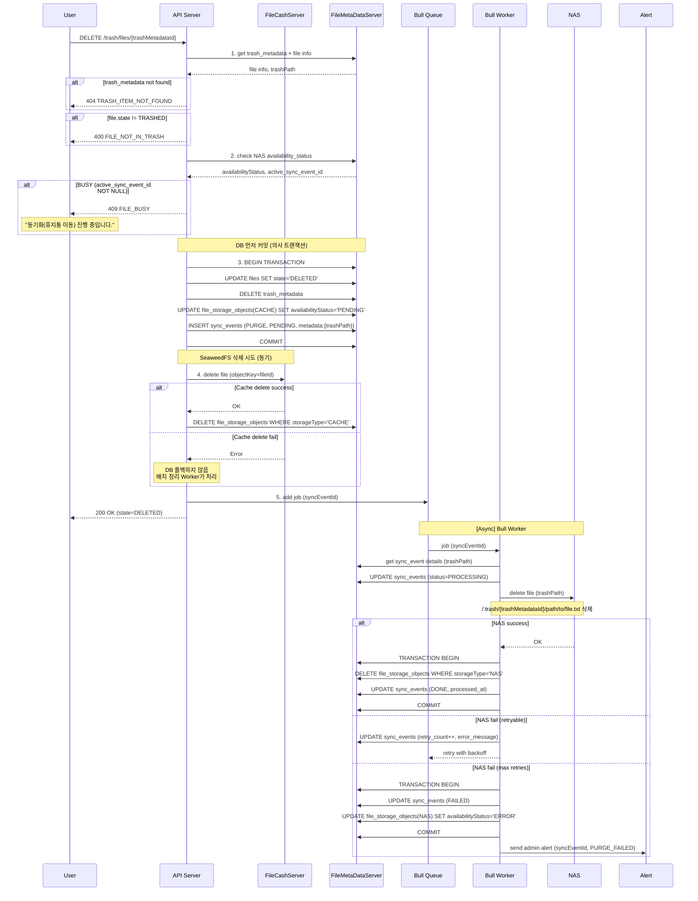

---

## 5. 일괄 처리

### 5-1. DELETE /trash/all - 휴지통 비우기

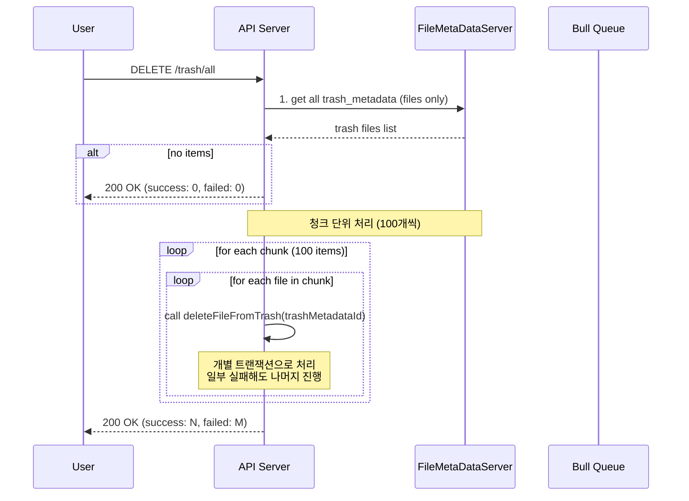

**응답 구조:**
```typescript
interface EmptyTrashResponse {
  message: string;
  success: number;
  failed: number;
}
```

---

### 5-2. 복구 프로세스 (2단계)

> **⚠️ 복구 경로가 없는 파일 처리 정책**
>
> | 상황 | 처리 |
> |------|------|
> | 복구 경로 있음 | 원래 경로로 복구 (또는 사용자 지정 경로) |
> | 복구 경로 없음 | 사용자가 복구 경로 지정 필수 (미지정 시 복구 불가) |
> | 모든 파일 세팅 완료 | 복구 실행 가능 |

**전체 플로우:**

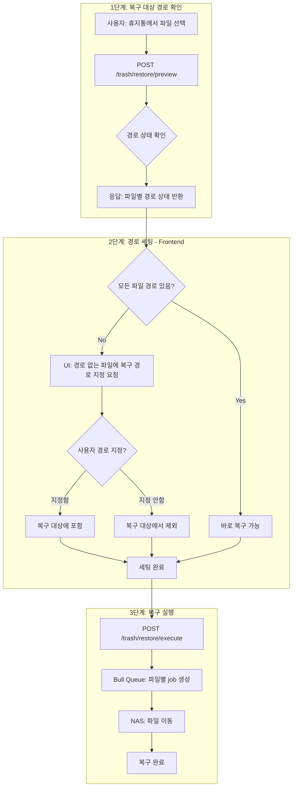

---

#### 5-2-1. POST /trash/restore/preview - 복구 경로 상태 확인

> 선택한 파일들의 복구 경로 상태를 미리 확인 (★ 경로명 기준)

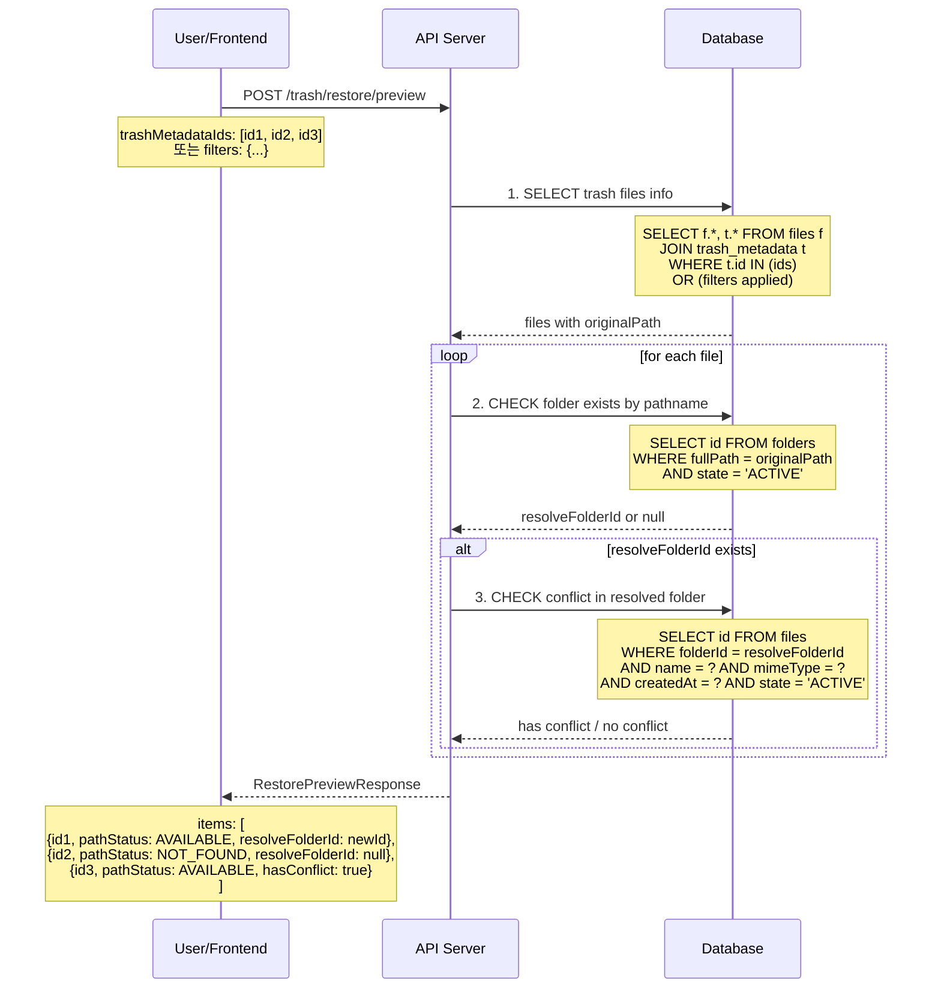

**요청 구조:**
```typescript
interface RestorePreviewRequest {
  // 방법 1: 특정 파일 ID 목록 (체크박스 선택)
  trashMetadataIds?: string[];
  
  // 방법 2: 필터 조건 (GET /trash와 동일)
  filters?: {
    search?: string;
    mimeType?: string;
    mimeCategory?: 'image' | 'video' | 'audio' | 'document' | 'archive' | 'other';
    deletedBy?: string;
    deletedAfter?: string;
    deletedBefore?: string;
    expiresAfter?: string;
    expiresBefore?: string;
    minSize?: number;
    maxSize?: number;
    originalFolderId?: string;
  };
}
```

**응답 구조:**
```typescript
interface RestorePreviewResponse {
  totalCount: number;
  
  items: {
    trashMetadataId: string;
    fileId: string;
    fileName: string;
    mimeType: string;
    sizeBytes: number;
    deletedAt: Date;
    
    // 경로 상태 (★ 경로명 기준)
    pathStatus: 'AVAILABLE' | 'NOT_FOUND';
    originalPath: string;               // "/projects/2024/reports/" (삭제 시점의 경로명)
    originalFolderId: string;           // 삭제 시점의 폴더 ID (참고용)
    resolveFolderId: string | null;     // ★ 경로명으로 찾은 현재 폴더 ID (AVAILABLE이면 값 있음)
    
    // 충돌 여부
    hasConflict: boolean;               // 동일 파일 존재 여부
    conflictFileId?: string;            // 충돌 파일 ID (hasConflict=true일 때)
  }[];
  
  // 요약
  summary: {
    available: number;    // 경로 있는 파일 수 (복구 가능)
    notFound: number;     // 경로 없는 파일 수 (경로 선택 필요)
    conflict: number;     // 충돌 파일 수
  };
}
```

**경로 확인 로직 (경로명 기준):**
```
┌─────────────────────────────────────────────────────────────────┐
│  trash_metadata.originalPath = "/projects/2024/"                │
│  trash_metadata.originalFolderId = "folder-old-123" (삭제됨)    │
└─────────────────────────────────────────────────────────────────┘
                              │
                              ▼
┌─────────────────────────────────────────────────────────────────┐
│  SELECT id FROM folders                                          │
│  WHERE fullPath = "/projects/2024/"                              │
│  AND state = 'ACTIVE'                                            │
└─────────────────────────────────────────────────────────────────┘
                              │
              ┌───────────────┴───────────────┐
              ▼                               ▼
    ┌──────────────────┐            ┌──────────────────┐
    │ 결과 있음         │            │ 결과 없음         │
    │ (folder-new-456) │            │                  │
    └────────┬─────────┘            └────────┬─────────┘
             │                               │
             ▼                               ▼
    ┌──────────────────┐            ┌──────────────────┐
    │ pathStatus:      │            │ pathStatus:      │
    │   AVAILABLE      │            │   NOT_FOUND      │
    │ resolveFolderId: │            │ resolveFolderId: │
    │   folder-new-456 │            │   null           │
    └──────────────────┘            └──────────────────┘
```

**응답 예시:**
```json
{
  "totalCount": 3,
  "items": [
    {
      "trashMetadataId": "trash-001",
      "fileId": "file-111",
      "fileName": "report.pdf",
      "mimeType": "application/pdf",
      "sizeBytes": 1024000,
      "deletedAt": "2026-01-20T10:00:00Z",
      "pathStatus": "AVAILABLE",
      "originalPath": "/projects/2024/",
      "originalFolderId": "folder-old-abc",
      "resolveFolderId": "folder-new-456",
      "hasConflict": false
    },
    {
      "trashMetadataId": "trash-002",
      "fileId": "file-222",
      "fileName": "image.png",
      "mimeType": "image/png",
      "sizeBytes": 512000,
      "deletedAt": "2026-01-19T15:30:00Z",
      "pathStatus": "NOT_FOUND",
      "originalPath": "/archive/old-project/",
      "originalFolderId": "folder-deleted",
      "resolveFolderId": null,
      "hasConflict": false
    },
    {
      "trashMetadataId": "trash-003",
      "fileId": "file-333",
      "fileName": "data.xlsx",
      "mimeType": "application/vnd.openxmlformats-officedocument.spreadsheetml.sheet",
      "sizeBytes": 256000,
      "deletedAt": "2026-01-18T09:00:00Z",
      "pathStatus": "AVAILABLE",
      "originalPath": "/documents/",
      "originalFolderId": "folder-xyz",
      "resolveFolderId": "folder-xyz",
      "hasConflict": true,
      "conflictFileId": "file-existing-333"
    }
  ],
  "summary": {
    "available": 2,
    "notFound": 1,
    "conflict": 1
  }
}
```

---

#### 5-2-2. POST /trash/restore/execute - 복구 실행

> 경로 세팅 완료 후 실제 복구 실행 (파일별 개별 Bull Queue job 생성)

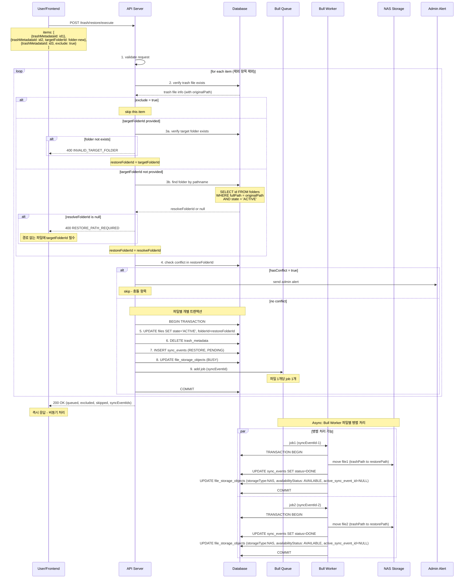


**요청 구조:**
```typescript
interface RestoreExecuteRequest {
  items: {
    trashMetadataId: string;
    
    // 복구 경로 지정 (선택사항)
    // - 미지정: preview에서 받은 resolveFolderId로 자동 복구 (pathStatus=AVAILABLE인 경우)
    // - 지정: 해당 폴더로 복구 (pathStatus=NOT_FOUND인 경우 필수)
    targetFolderId?: string;
    
    // 복구 제외 (선택사항)
    // - true: 이 파일은 복구하지 않음
    exclude?: boolean;
  }[];
}
```

**복구 경로 결정 로직:**
```
┌─────────────────────────────────────────────────────────────────┐
│  execute 요청 시 복구 경로 결정                                  │
├─────────────────────────────────────────────────────────────────┤
│                                                                 │
│  if (item.targetFolderId 지정됨) {                              │
│    → targetFolderId로 복구                                      │
│  } else if (preview.resolveFolderId 있음) {                     │
│    → resolveFolderId로 자동 복구 (경로명 기준 찾은 폴더)          │
│  } else {                                                       │
│    → 400 RESTORE_PATH_REQUIRED 에러                             │
│  }                                                              │
│                                                                 │
└─────────────────────────────────────────────────────────────────┘
```

**응답 구조:**
```typescript
interface RestoreExecuteResponse {
  message: string;
  
  // 결과 통계
  queued: number;           // Bull Queue에 추가된 job 수
  excluded: number;         // 사용자가 제외한 항목 수
  skipped: number;          // 충돌로 skip된 항목 수
  
  // 생성된 sync_event ID 목록 (진행 상황 추적용)
  syncEventIds: string[];
  
  // 충돌로 skip된 항목 상세
  skippedItems: {
    trashMetadataId: string;
    fileName: string;
    reason: 'CONFLICT';
    conflictFileId: string;
  }[];
}
```

**요청 예시:**
```typescript
// 예시: 3개 파일 중 1개 제외, 1개 경로 지정
POST /trash/restore/execute
{
  "items": [
    { 
      "trashMetadataId": "trash-001"
      // targetFolderId 없음 → 원래 경로로 복구
    },
    { 
      "trashMetadataId": "trash-002",
      "targetFolderId": "folder-recovered"  // 경로 없어서 새 경로 지정
    },
    { 
      "trashMetadataId": "trash-003",
      "exclude": true  // 복구 제외 (충돌 파일)
    }
  ]
}
```

**응답 예시:**
```json
{
  "message": "복구 작업이 시작되었습니다.",
  "queued": 2,
  "excluded": 1,
  "skipped": 0,
  "syncEventIds": ["sync-001", "sync-002"],
  "skippedItems": []
}
```

---

#### 5-2-3. 전체 복구 프로세스 시퀀스 다이어그램

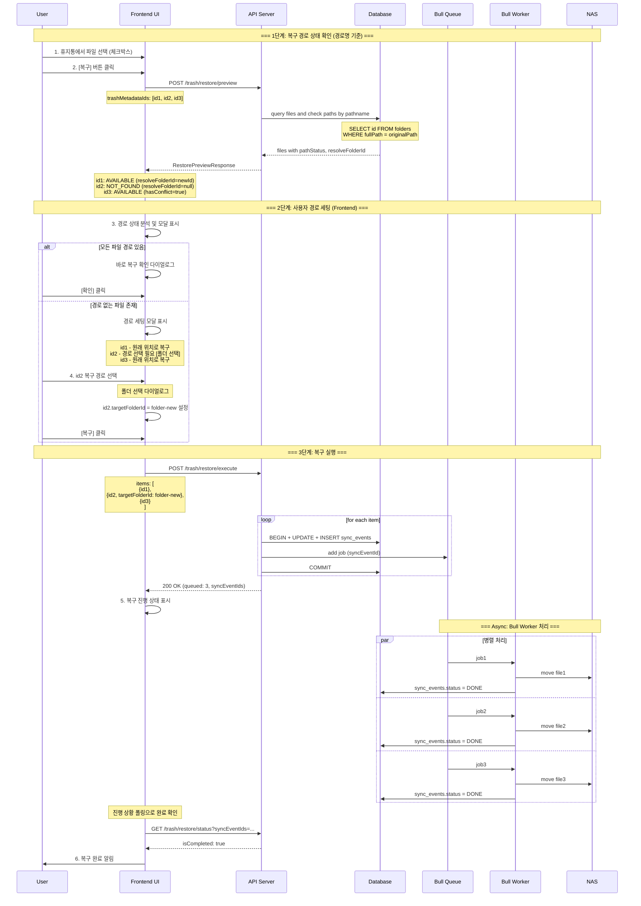

---

#### 5-2-4. Frontend UI 플로우

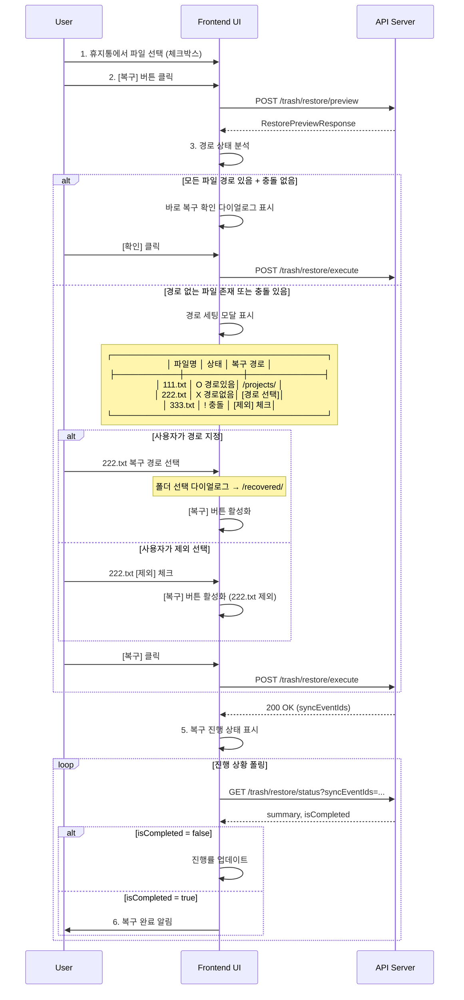

**UI 모달 예시:**

> **상태 표시 기준:** 경로명으로 폴더 존재 여부 확인
> - ✅ 경로있음: 동일 경로명의 폴더가 존재 → 자동 복구 가능
> - ⚠️ 경로없음: 해당 경로명의 폴더가 없음 → 경로 선택 필요
> - ⛔ 충돌: 복구 위치에 동일 파일 존재 → 복구 불가

```
┌─────────────────────────────────────────────────────────────┐
│  파일 복구                                            [X]   │
├─────────────────────────────────────────────────────────────┤
│                                                             │
│  선택한 3개 파일의 복구 경로를 확인해주세요.                  │
│                                                             │
│  ┌─────────────────────────────────────────────────────┐   │
│  │ 파일명        │ 상태      │ 복구 경로               │   │
│  ├───────────────┼───────────┼─────────────────────────┤   │
│  │ 111.txt       │ ✅ 경로있음│ /projects/2024/        │   │
│  │               │           │ ☐ 다른 경로 지정        │   │
│  ├───────────────┼───────────┼─────────────────────────┤   │
│  │ 222.txt       │ ⚠️ 경로없음│ [📁 경로 선택]         │   │
│  │               │           │ ☐ 복구에서 제외         │   │
│  ├───────────────┼───────────┼─────────────────────────┤   │
│  │ 333.txt       │ ⛔ 충돌    │ 동일 파일 존재          │   │
│  │               │           │ ☑ 복구에서 제외         │   │
│  └───────────────┴───────────┴─────────────────────────┘   │
│                                                             │
│  ⚠️ 경로가 없는 파일은 복구 경로를 지정하거나 제외해주세요.    │
│  ⛔ 충돌 파일은 관리자 문의가 필요합니다.                      │
│                                                             │
├─────────────────────────────────────────────────────────────┤
│                              [취소]  [복구] (비활성화)       │
└─────────────────────────────────────────────────────────────┘
```

↓ 222.txt 경로 선택 후

```
┌─────────────────────────────────────────────────────────────┐
│  │ 222.txt       │ ✅ 경로지정│ /documents/recovered/  │   │
│  │               │           │ [변경]                 │   │
├─────────────────────────────────────────────────────────────┤
│                              [취소]  [복구] ← 활성화        │
└─────────────────────────────────────────────────────────────┘
```

---

### 5-3. GET /trash/restore/status - 복구 진행 상황 조회

> **용도:** POST /trash/restore/execute 호출 후 반환된 `syncEventIds`로 진행 상황 확인

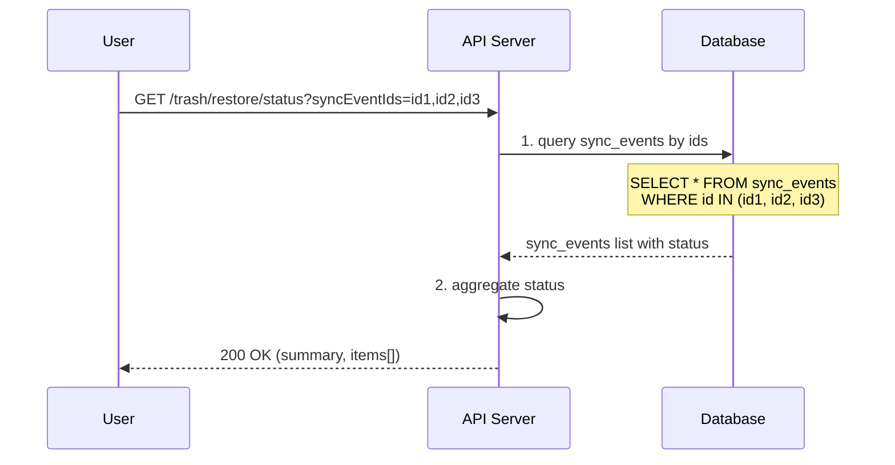

**요청:**
```
GET /trash/restore/status?syncEventIds=sync-001,sync-002,sync-003
```

**응답 구조:**
```typescript
interface RestoreStatusResponse {
  // 전체 요약
  summary: {
    total: number;
    pending: number;      // 대기중
    processing: number;   // 처리중
    done: number;         // 완료
    failed: number;       // 실패
  };
  
  // 전체 완료 여부
  isCompleted: boolean;   // pending=0 && processing=0
  
  // 개별 항목 상태
  items: {
    syncEventId: string;
    fileId: string;
    fileName: string;
    status: 'PENDING' | 'PROCESSING' | 'DONE' | 'FAILED';
    errorMessage?: string;
    createdAt: Date;
    processedAt?: Date;
  }[];
}
```

**사용 예시:**
```typescript
// 1. 복구 실행
const response = await fetch('POST /trash/restore/execute', {
  body: JSON.stringify({ items: [...] })
});
const { syncEventIds } = await response.json();

// 2. 진행 상황 폴링
const checkStatus = async () => {
  const status = await fetch(
    `GET /trash/restore/status?syncEventIds=${syncEventIds.join(',')}`
  );
  const { isCompleted, summary } = await status.json();
  
  console.log(`진행: ${summary.done}/${summary.total} 완료`);
  
  if (!isCompleted) {
    setTimeout(checkStatus, 2000); // 2초 후 재확인
  } else {
    console.log('모든 복원 완료!');
    if (summary.failed > 0) {
      console.log(`${summary.failed}개 파일 복원 실패`);
    }
  }
};

checkStatus();
```

---

## 6. 자동 영구삭제 (배치)

### 6-1. 만료된 휴지통 항목 자동 삭제

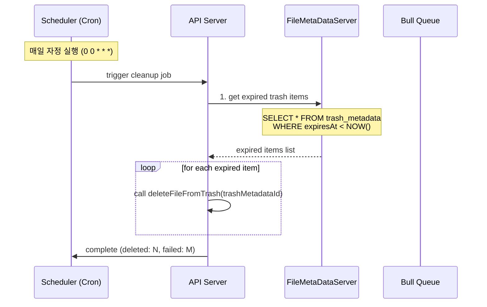

---

## 7. NAS 경로 규칙

### 7-1. 휴지통 경로 구조

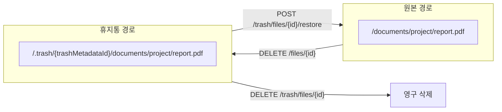

### 7-2. sync_events eventType 정리

| eventType | 설명 | metadata |
|-----------|------|----------|
| `TRASH` | 파일 휴지통 이동 | `{ originalPath, originalFolderId }` |
| `RESTORE` | 파일 복구 | `{ trashPath, restorePath }` |
| `PURGE` | 파일 영구 삭제 | `{ trashPath }` |

---

## 8. 상태 조회

### 8-1. GET /sync-events/{syncEventId} - 동기화 상태 조회

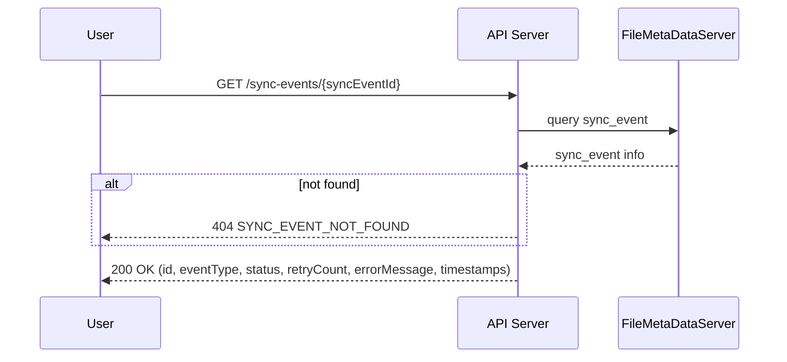

**응답 구조:**
```typescript
interface SyncEventResponse {
  id: string;
  eventType: 'TRASH' | 'RESTORE' | 'PURGE';
  status: 'PENDING' | 'PROCESSING' | 'DONE' | 'FAILED';
  retryCount: number;
  errorMessage?: string;
  metadata: Record<string, any>;
  createdAt: Date;
  processedAt?: Date;
}
```

---

## 참고

- [005-1.파일_처리_FLOW.md](../파일/005-1.파일_처리_FLOW.md) - 파일 처리 FLOW (4-1 파일 삭제)
- [008-1.폴더_처리_FLOW.md](../폴더/008-1.폴더_처리_FLOW.md) - 폴더 처리 FLOW (4-1 폴더 삭제 - 빈 폴더 즉시 삭제)
- [060.휴지통_version0.0.1.md](./060.휴지통_version0.0.1.md) - 휴지통 상세 문서 (레거시)
- [001.정의.md](../001.정의.md) - 공통 사항
- [050.큐관리.md](../050.큐관리.md) - Bull 큐 관리
